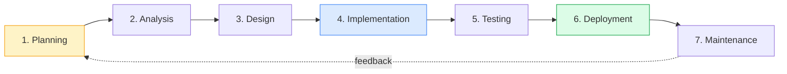
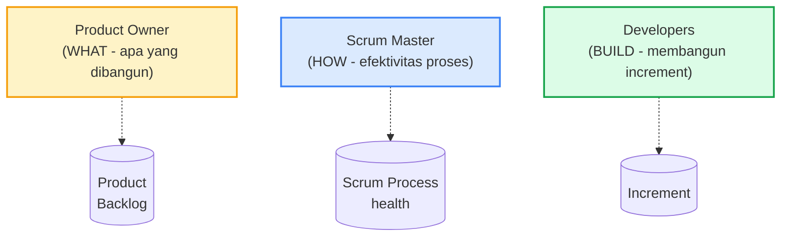
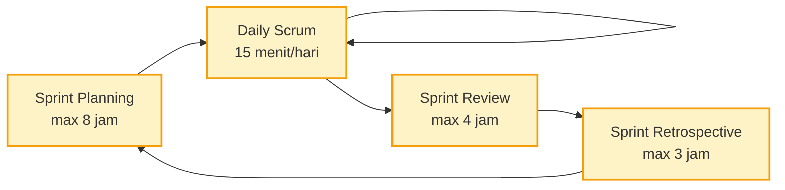
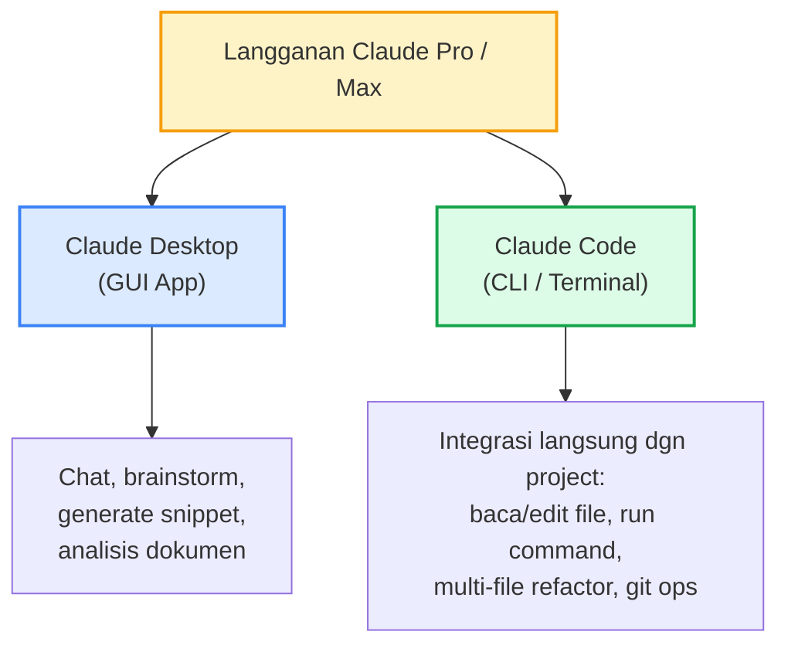

# Modul 1 — SDLC & Scrum Agile

> **Konteks**: Materi ini ditujukan untuk peserta Officer Development Program (ODP) BSI — baik track IT maupun non-IT yang akan berinteraksi dengan tim pengembangan. Tujuannya: paham siklus pengembangan software, kenapa metodologi penting, dan bagaimana Scrum (sebagai implementasi Agile paling populer) bekerja dalam konteks perbankan syariah.

> Setelah modul ini Anda harus bisa: (a) menjelaskan fase-fase SDLC dan kapan masing-masing pendekatan dipakai, (b) memahami nilai & prinsip Agile, (c) menjalankan peran dalam tim Scrum (Product Owner, Scrum Master, atau Developer), (d) menulis user story yang baik dan memahami estimasi, (e) berkolaborasi efektif dengan tim IT/bisnis lewat Scrum events.

---

## 1. Pengantar — Mengapa SDLC & Agile Penting di BSI

Industri perbankan, terutama perbankan syariah, sedang dalam fase **transformasi digital** yang masif. Layanan yang dulu hanya bisa diakses di cabang kini harus tersedia di aplikasi mobile, ATM, web, hingga channel pihak ketiga. Untuk merespon ini, BSI butuh tim pengembangan yang **cepat namun terkendali** — di sinilah SDLC dan metodologi Agile berperan.

### Mengapa ODP harus paham?

| Peran | Kenapa perlu SDLC & Agile |
|---|---|
| **Bisnis / Cabang** | Tahu cara mengajukan kebutuhan ke IT supaya jelas dan bisa dikerjakan |
| **Operasional** | Bisa membuat acceptance criteria untuk fitur yang akan diuji |
| **IT Track** | Akan langsung terjun ke proyek pengembangan |
| **Risk / Compliance** | Memastikan regulasi terakomodasi di setiap sprint |
| **Manajemen** | Membaca laporan progress, velocity, dan burn-down chart |

### Dampak nyata kalau tidak ada metodologi

```
Tanpa SDLC/Scrum:                   Dengan SDLC/Scrum:
─────────────────                   ──────────────────
× Requirement tidak jelas           ✓ Requirement diformalkan (user story)
× IT bikin sendiri tanpa validasi   ✓ Review berkala dengan bisnis
× Bug ditemukan saat go-live        ✓ Testing terintegrasi di tiap fase
× Tidak ada visibility progress     ✓ Daily standup + burn-down chart
× Rilis besar berisiko tinggi       ✓ Rilis kecil & sering, risiko terkelola
```

---

## 2. SDLC — Software Development Life Cycle

**SDLC** adalah serangkaian fase yang dilalui suatu perangkat lunak dari ide awal hingga digunakan & dipelihara. Anggap seperti **siklus hidup produk** — mulai dari konsep, lahir, dipakai, sampai pensiun.

### 2.1 Tujuh Fase Klasik SDLC



| Fase | Aktivitas Utama | Output |
|---|---|---|
| **1. Planning** | Identifikasi kebutuhan bisnis, feasibility study, alokasi sumber daya | Project charter, scope statement |
| **2. Analysis** | Gali kebutuhan detail (interview stakeholder, observasi proses bisnis) | SRS (Software Requirement Specification) |
| **3. Design** | Rancang arsitektur sistem, database schema, UI/UX | Technical design document, mockup |
| **4. Implementation** | Coding sesuai design | Source code, build artifact |
| **5. Testing** | Unit test, integration test, UAT (User Acceptance Test) | Test report, bug list |
| **6. Deployment** | Rilis ke production, training user | Sistem live, manual user |
| **7. Maintenance** | Bug fix, enhancement, monitoring | Patch, update version |

### 2.2 Contoh di BSI: Pengembangan Fitur QRIS Tabungan Haji

| Fase | Aktivitas Konkret |
|---|---|
| Planning | Bisnis ajukan kebutuhan: nasabah haji bisa setor lewat QRIS. Disepakati timeline 3 bulan. |
| Analysis | Wawancara dengan tim Tabungan Haji, regulator (OJK syariah), nasabah eksisting. Identifikasi flow setor, limit, audit trail. |
| Design | Bikin flow chart, ERD database, UI mobile banking, integrasi ke core banking syariah. |
| Implementation | Tim mobile coding, tim backend bikin API, tim core banking sambungkan ke tabungan. |
| Testing | Unit test per modul → integration test antar tim → UAT dengan staff cabang. |
| Deployment | Rilis bertahap: 10 cabang pilot → 100 cabang → seluruh Indonesia. |
| Maintenance | Monitoring transaksi, fix bug yang muncul setelah live, tambah fitur reporting. |

---

## 3. SDLC Models — Pilihan Pendekatan

SDLC adalah **konsep umum**. Cara menjalankannya bermacam-macam. Berikut model utama yang umum di industri:

### 3.1 Waterfall

**Karakteristik**: fase berurutan, satu fase harus selesai sebelum fase berikutnya dimulai. Mirip air terjun — air mengalir ke bawah, tidak balik ke atas.

```
Planning ─→ Analysis ─→ Design ─→ Impl ─→ Testing ─→ Deploy
   │           │          │        │         │         │
   └───────────┴──────────┴────────┴─────────┴─────────┘
              Tidak ada balik arah (idealnya)
```

**Cocok untuk**:
- Project dengan requirement sangat jelas & tidak akan berubah (contoh: implementasi sistem yang sudah mature)
- Proyek dengan regulasi ketat yang butuh dokumentasi lengkap di setiap fase
- Tim besar dengan koordinasi sulit

**Tidak cocok untuk**:
- Product yang butuh iterasi cepat
- Requirement yang belum jelas atau pasti berubah
- Proyek inovasi/eksperimen

### 3.2 Iterative & Incremental

Bagi project jadi beberapa **iterasi pendek**. Tiap iterasi menghasilkan increment fungsionalitas. Berbeda dari Waterfall yang sekali jalan sampai selesai.

```
Iterasi 1: [Plan→Design→Build→Test] → fitur dasar
Iterasi 2: [Plan→Design→Build→Test] → tambah fitur
Iterasi 3: [Plan→Design→Build→Test] → finalisasi
```

**Cocok untuk**: project besar yang bisa dipecah jadi modul-modul independen.

### 3.3 Spiral

Iterative + emphasis ke **risk management**. Setiap loop spiral menambah analisis risiko sebelum lanjut.

**Cocok untuk**: project dengan risiko tinggi (mis. integrasi dengan sistem legacy yang kompleks).

### 3.4 Agile

Mindset yang menekankan **adaptasi cepat terhadap perubahan**. Bukan satu metodologi spesifik — Scrum, Kanban, XP, SAFe semuanya implementasi dari mindset Agile.

```
Sprint 1 ─→ Sprint 2 ─→ Sprint 3 ─→ ... → Release
   ↑           ↑           ↑
   └───── Feedback ────────┘
       (continuous)
```

**Cocok untuk**: product development di mana requirement bisa berubah, time-to-market penting, dan team relatif kecil (5–9 orang).

### 3.5 DevOps

Bukan SDLC model tradisional, tapi **pendekatan budaya** yang menggabungkan Development dan Operations. Fokus pada otomasi, continuous integration, continuous deployment (CI/CD).

```
Dev ─→ Build ─→ Test ─→ Release ─→ Deploy ─→ Operate ─→ Monitor ─→ Dev
                       (automated)
```

**Cocok untuk**: aplikasi yang butuh rilis sering, layanan cloud-native.

### 3.6 Pemilihan Model — Ringkasan

| Model | Time-to-market | Adaptasi perubahan | Dokumentasi | Cocok untuk BSI |
|---|---|---|---|---|
| Waterfall | Lambat | Sulit | Lengkap | Core banking migration, regulasi baru |
| Iterative | Sedang | Sedang | Cukup | Modul independen (mis. modul tabungan) |
| Spiral | Sedang | Sedang | Lengkap | Integrasi legacy + sistem baru |
| **Agile/Scrum** | **Cepat** | **Sangat baik** | Cukup | **Mobile banking, fitur digital baru** |
| DevOps | Sangat cepat | Sangat baik | Otomatis di pipeline | Layanan cloud, API gateway |

> **Catatan**: di BSI, biasanya **kombinasi** dipakai. Core banking pakai Waterfall karena regulasi ketat, sedangkan mobile/digital product pakai Scrum karena butuh iterasi cepat.

---

## 4. Manifesto Agile — Filosofi Dasar

Pada Februari 2001, 17 software engineer berkumpul di Snowbird, Utah dan menyusun **Manifesto Agile**. Ini bukan metodologi, melainkan **set nilai dan prinsip** yang jadi fondasi semua framework Agile (Scrum, Kanban, XP, dll).

### 4.1 Empat Nilai Agile

| Lebih menghargai | … di atas | Penjelasan |
|---|---|---|
| **Individu & interaksi** | Proses & tools | Tools penting, tapi yang bikin software jalan adalah orang & komunikasi |
| **Software yang berfungsi** | Dokumentasi yang komprehensif | Dokumen tetap perlu, tapi prioritas utama: kode yang jalan & bermanfaat |
| **Kolaborasi dengan customer** | Negosiasi kontrak | Customer adalah partner, bukan lawan negosiasi |
| **Merespons perubahan** | Mengikuti rencana | Rencana dibuat untuk berubah seiring pemahaman bertambah |

**Penting**: ini **bukan "kanan tidak penting"** — keduanya penting, tapi yang **kiri lebih diprioritaskan**.

### 4.2 Dua Belas Prinsip Agile

1. Kepuasan customer lewat **delivery berkala** software yang bernilai.
2. **Sambut perubahan requirement**, bahkan di tahap akhir.
3. Deliver software yang berfungsi **secara rutin** (mingguan/bulanan).
4. **Bisnis dan developer bekerja bersama** setiap hari.
5. Bangun project di sekitar **individu yang termotivasi**, beri mereka lingkungan & dukungan.
6. **Komunikasi tatap muka** paling efektif.
7. **Software yang jalan** adalah ukuran utama kemajuan.
8. **Pace yang berkelanjutan** — tim bisa mempertahankan tempo tanpa burnout.
9. Perhatian berkelanjutan pada **technical excellence** & desain yang baik.
10. **Simplicity** — seni memaksimalkan pekerjaan yang TIDAK dikerjakan.
11. Arsitektur, requirement, dan desain terbaik muncul dari **tim yang self-organizing**.
12. Tim secara rutin **merefleksikan** cara kerja & menyesuaikan.

### 4.3 Mindset Shift dari Waterfall

| Waterfall mindset | Agile mindset |
|---|---|
| "Kita harus tahu semua di awal" | "Kita belajar sambil mengerjakan" |
| "Perubahan = kegagalan planning" | "Perubahan = peluang menyesuaikan" |
| "Dokumen menentukan apa yang dibangun" | "Percakapan menentukan apa yang dibangun" |
| "Customer baru lihat di akhir" | "Customer lihat & feedback tiap iterasi" |
| "Tim terbagi per fungsi (analyst, dev, tester)" | "Tim cross-functional" |

---

## 5. SCRUM Framework — Implementasi Agile Paling Populer

**Scrum** adalah framework Agile yang paling banyak diadopsi (~80% adopsi Agile pakai Scrum). Dibuat oleh Ken Schwaber dan Jeff Sutherland. Definisi resminya ada di **Scrum Guide** (gratis, ~13 halaman).

### 5.1 Apa itu Scrum?

> "Scrum adalah framework ringan yang membantu orang, tim, dan organisasi menciptakan nilai melalui solusi adaptif untuk masalah kompleks." — Scrum Guide

Tiga kata kunci:
- **Ringan**: aturan sederhana, sedikit ceremony.
- **Adaptif**: didesain untuk merespons perubahan.
- **Kompleks**: cocok untuk masalah yang requirement-nya tidak bisa diketahui sepenuhnya di awal.

### 5.2 Tiga Pilar Empirisme

Scrum dibangun di atas **empirisme** — keputusan dibuat berdasarkan observasi, bukan asumsi. Tiga pilar:

| Pilar | Artinya | Praktik di Scrum |
|---|---|---|
| **Transparency** (Transparansi) | Semua yang relevan harus terlihat oleh yang membuat keputusan | Product Backlog terbuka, burn-down chart visible |
| **Inspection** (Inspeksi) | Periksa progress & artifact secara teratur untuk deteksi penyimpangan | Sprint Review, Daily Scrum |
| **Adaptation** (Adaptasi) | Sesuaikan rencana berdasarkan hasil inspeksi | Sprint Retrospective, refinement backlog |

### 5.3 Lima Nilai Scrum

| Nilai | Manifestasi |
|---|---|
| **Commitment** | Tim berkomitmen pada Sprint Goal |
| **Focus** | Fokus pada pekerjaan Sprint, tidak terdistraksi |
| **Openness** | Terbuka tentang progress & hambatan |
| **Respect** | Hormati anggota tim sebagai individu profesional |
| **Courage** | Berani mengangkat masalah, bilang "tidak" untuk scope yang berlebihan |

---

## 6. Scrum Team — Tiga Akuntabilitas

Tim Scrum terdiri dari **3 akuntabilitas** (sejak Scrum Guide 2020, istilah "role" diganti "accountability"). Total tim biasanya **5–9 orang**.



### 6.1 Product Owner (PO)

**Tanggung jawab**: memaksimalkan nilai produk dari hasil kerja Scrum Team.

Tugas konkret:
- Menyusun & memprioritaskan **Product Backlog**.
- Memutuskan **apa** yang dikerjakan (tidak "bagaimana").
- Menjelaskan visi produk ke tim.
- Berinteraksi dengan stakeholder & pengguna.
- **Satu** orang PO per produk (bukan komite).

Profil cocok di BSI: business analyst, product manager, kepala unit bisnis yang punya wewenang prioritas.

### 6.2 Scrum Master (SM)

**Tanggung jawab**: menjamin efektivitas Scrum Team dengan membantu mereka meningkatkan praktiknya.

Tugas konkret:
- Coaching tim dalam Scrum.
- **Menghilangkan impediment** (hambatan yang menghambat tim).
- Fasilitasi Scrum events.
- **Bukan** project manager — tidak memberi perintah, melainkan **melayani**.
- Mendidik organisasi tentang Scrum.

Profil cocok: orang yang punya soft skill kuat (fasilitator, mediator), bisa coaching. Bukan posisi senioritas teknis — lebih ke leadership servant.

### 6.3 Developers

**Tanggung jawab**: menciptakan increment (potongan fitur jadi) tiap Sprint.

Tugas konkret:
- Menyusun **Sprint Backlog**.
- Memastikan kualitas (Definition of Done terpenuhi).
- Mengadaptasi rencana Sprint sesuai progress.
- **Cross-functional** — bisa kerjakan semua aspek (analisis, design, code, test).
- **Self-organizing** — tim sendiri yang putuskan cara terbaik mengerjakan.

Profil di BSI: developer, tester, UI/UX designer, system analyst — biasanya jadi satu tim Scrum.

### 6.4 Ukuran Tim Ideal

| Ukuran | Catatan |
|---|---|
| 3 orang | Terlalu kecil — risiko kalau ada yang cuti |
| 5–7 orang | **Optimal** untuk komunikasi & koordinasi |
| 8–9 orang | Masih oke, mulai ada overhead |
| > 10 orang | Pecah jadi 2 tim, pakai framework scaling (LeSS, SAFe, Nexus) |

---

## 7. Scrum Events — Lima Acara Tetap

Semua aktivitas Scrum terjadi dalam 5 events. Aturan: **time-boxed** — ada batas waktu maksimal supaya tidak melar.



(Semuanya berada dalam container **The Sprint** — biasanya 2 minggu.)

### 7.1 The Sprint (Container)

**Definisi**: periode time-boxed 1–4 minggu (umumnya **2 minggu**) di mana increment "Done" dibuat.

Aturan:
- Tidak ada perubahan yang membahayakan Sprint Goal.
- Quality goal tidak diturunkan.
- Scope **bisa diklarifikasi & dinegosiasi** antara PO dan Developers seiring belajar.

### 7.2 Sprint Planning

**Time-box**: maks 8 jam untuk Sprint 1 bulan; proporsional untuk Sprint lebih pendek (4 jam untuk 2 minggu).

**Yang dilakukan**: tim merencanakan pekerjaan untuk Sprint berikutnya. Tiga pertanyaan:

| Pertanyaan | Output |
|---|---|
| **Why** — kenapa Sprint ini bernilai? | **Sprint Goal** |
| **What** — apa yang bisa dikerjakan? | **Sprint Backlog (top items)** |
| **How** — bagaimana mengerjakannya? | **Plan teknis** |

### 7.3 Daily Scrum

**Time-box**: 15 menit, tiap hari kerja, jam sama, tempat sama.

**Yang dilakukan**: Developers (PO/SM boleh hadir) inspect progress menuju Sprint Goal, sesuaikan rencana.

Format klasik (3 pertanyaan, bukan wajib):
1. Apa yang saya kerjakan kemarin yang membantu Sprint Goal?
2. Apa yang akan saya kerjakan hari ini?
3. Ada impediment yang menghalangi saya/tim?

**Bukan** status report ke manajer — ini koordinasi internal tim.

### 7.4 Sprint Review

**Time-box**: maks 4 jam untuk Sprint 1 bulan; 2 jam untuk Sprint 2 minggu.

**Yang dilakukan**: Scrum Team **mempresentasikan increment** ke stakeholder, ambil feedback. Bukan presentasi formal — lebih ke **working session** untuk inspect what was done.

Output:
- Feedback untuk update Product Backlog.
- Kolaborasi bisnis & dev tentang next steps.

### 7.5 Sprint Retrospective

**Time-box**: maks 3 jam untuk Sprint 1 bulan; 1.5 jam untuk Sprint 2 minggu.

**Yang dilakukan**: Scrum Team refleksi proses kerja sendiri. Fokus internal, **tidak ada stakeholder**.

Format umum:
- Apa yang **berjalan baik**?
- Apa yang **bisa diperbaiki**?
- **Action item** konkret untuk Sprint berikutnya.

Output: 1–3 improvement actionable yang dimasukkan ke Sprint Backlog berikutnya.

### 7.6 Backlog Refinement (bukan event resmi, tapi aktivitas penting)

**Bukan termasuk 5 events resmi**, tapi aktivitas ongoing untuk:
- Memecah item backlog yang besar (epic → story).
- Klarifikasi requirement.
- Estimasi.
- Maintain backlog tetap relevan.

Biasanya dialokasikan **10% dari waktu Sprint** untuk refinement.

---

## 8. Scrum Artifacts — Tiga Output Utama

Setiap artifact berisi **commitment** tertentu — janji yang diukur.

| Artifact | Berisi | Commitment |
|---|---|---|
| **Product Backlog** | Semua yang mungkin dibutuhkan produk (fitur, bug, technical debt) | **Product Goal** |
| **Sprint Backlog** | Apa yang dipilih untuk Sprint ini + rencana mengerjakannya | **Sprint Goal** |
| **Increment** | Versi produk yang sudah jadi & potential shippable | **Definition of Done** |

### 8.1 Product Backlog

- **Hidup** — terus diupdate, refined.
- Diprioritaskan oleh **Product Owner**.
- Item di atas (high priority) lebih **detail**, di bawah lebih kasar.

Contoh isi di BSI:
```
[High priority — siap untuk Sprint mendatang]
- User story: "Sebagai nasabah, saya bisa setor dana via QRIS ke tabungan haji"
- User story: "Sebagai admin, saya bisa lihat dashboard transaksi QRIS"
- Bug: "Saldo tampil keliru saat mutasi cross-cabang"

[Medium — perlu di-refine dulu]
- Epic: "Integrasi tabungan emas digital"
- Epic: "Mobile banking versi simplified untuk lansia"

[Low — ide kasar, belum prioritas]
- "Fitur chatbot untuk customer service"
- "Notifikasi push untuk reminder zakat"
```

### 8.2 Sprint Backlog

= Sprint Goal + items dari Product Backlog yang dipilih + plan untuk delivery.

Berbeda dari Product Backlog yang owned PO, **Sprint Backlog dimiliki Developers** — mereka yang putuskan cara kerjakannya.

### 8.3 Increment

Step konkret menuju Product Goal. Tiap Sprint menghasilkan **1+ increment** yang sudah memenuhi Definition of Done.

**Sangat penting**: increment harus **usable** (bisa dipakai). Bukan setengah jadi.

### 8.4 Definition of Done (DoD)

**Definisi**: checklist kualitas yang harus dipenuhi sebelum item bisa disebut "Done".

Contoh DoD di tim BSI mobile banking:
```
□ Code complete sesuai user story
□ Unit test passed (coverage > 80%)
□ Integration test passed
□ Code review approved oleh 2 reviewer
□ Tidak ada critical/high bug
□ Dokumentasi API ter-update
□ Tested di device Android & iOS
□ Approved oleh QA team
□ Approved oleh Product Owner
□ Security scan passed
□ Performance test passed (response time < 2 detik)
```

DoD **tidak berubah** mid-Sprint. Kalau perlu diubah, ubah di Retrospective.

### 8.5 Definition of Ready (DoR)

**Definisi**: kriteria yang harus dipenuhi sebelum item boleh masuk Sprint.

Contoh DoR:
```
□ User story ditulis format INVEST
□ Acceptance criteria jelas
□ Sudah di-estimasi oleh tim
□ Dependency ke tim lain teridentifikasi
□ Mockup/wireframe tersedia (untuk fitur UI)
□ Data test tersedia
□ Compliance/security review (untuk fitur sensitif)
```

DoR memastikan tim tidak commit ke pekerjaan yang belum siap.

---

## 9. Praktik & Tools

### 9.1 Format User Story

Standar de facto:

```
Sebagai <peran/persona>,
Saya ingin <tujuan/fungsi>,
Sehingga <nilai bisnis yang didapat>.
```

Contoh:
```
Sebagai nasabah tabungan haji,
Saya ingin bisa setor dana lewat QRIS dari aplikasi BSI Mobile,
Sehingga saya tidak perlu ke cabang untuk top-up tabungan haji.
```

### 9.2 Prinsip INVEST untuk Story yang Baik

| Huruf | Artinya | Penjelasan |
|---|---|---|
| **I**ndependent | Tidak terikat story lain | Bisa dikerjakan & dirilis sendiri |
| **N**egotiable | Detail bisa dinegosiasikan | Story bukan kontrak rigid |
| **V**aluable | Punya nilai bagi user/bisnis | Bukan task internal yang user tidak peduli |
| **E**stimable | Bisa diestimasi | Cukup jelas untuk perkirakan effort |
| **S**mall | Cukup kecil untuk 1 Sprint | Kalau besar, pecah jadi beberapa |
| **T**estable | Bisa diuji | Acceptance criteria jelas |

### 9.3 Acceptance Criteria

Spesifik & terukur. Format yang umum: **Given / When / Then** (Gherkin syntax).

Contoh:
```
Story: "Setor via QRIS ke tabungan haji"

AC 1 — Setor sukses:
  Given saya login sebagai nasabah tabungan haji
  When saya scan QRIS merchant haji dan input nominal Rp 500.000
  Then saldo tabungan haji bertambah Rp 500.000
  And mutasi tercatat dengan jenis "Setor QRIS"

AC 2 — Saldo tidak cukup:
  Given saldo rekening sumber Rp 100.000
  When saya scan QRIS dan input nominal Rp 500.000
  Then sistem tampilkan error "Saldo tidak mencukupi"
  And transaksi dibatalkan
```

### 9.4 Story Points & Estimasi

Bukan estimasi waktu (jam/hari) — melainkan **ukuran relatif kompleksitas**.

Skala umum: **Fibonacci** (1, 2, 3, 5, 8, 13, 21).

Kenapa Fibonacci? Karena makin besar story, makin tinggi ketidakpastian — gap antar angka makin besar.

| Story Points | Artinya |
|---|---|
| 1 | Sangat sederhana, jelas |
| 2 | Sederhana, sedikit kompleksitas |
| 3 | Standar, normal |
| 5 | Cukup kompleks |
| 8 | Kompleks, beberapa unknown |
| 13 | Sangat kompleks — pertimbangkan pecah |
| 21+ | Terlalu besar — wajib pecah jadi smaller story |

**Cara estimasi**: Planning Poker. Tiap dev pilih kartu (angka) bersamaan, diskusi kalau ada perbedaan jauh, vote ulang sampai konsensus.

### 9.5 Velocity & Burn-down Chart

**Velocity**: total story points yang diselesaikan tim per Sprint. Setelah beberapa Sprint stabil, jadi prediktor kapasitas.

```
Sprint 1: 24 points
Sprint 2: 28 points
Sprint 3: 26 points
Sprint 4: 27 points
─────────────────
Velocity ≈ 26 points/sprint
```

**Burn-down chart**: grafik sisa pekerjaan vs hari. Ideal: garis turun dari kiri-atas ke kanan-bawah.

```
Story
Points
  ^
50│●
  │ ╲
40│  ●
  │   ╲
30│    ●─●
  │       ╲
20│        ●
  │         ╲
10│          ●
  │           ╲
 0│────────────●─────→ Hari
  1  2  3  4  5  6  7  8  9 10
```

Kalau garis flat (tidak turun), tim stuck atau scope nambah → perlu intervensi.

---

## 10. Studi Kasus — Implementasi Scrum di BSI Mobile Banking

### Skenario

Tim **BSI Mobile** sedang mengembangkan fitur baru: **"Setor Dana QRIS ke Tabungan Haji"**. Tim terdiri dari:

| Akuntabilitas | Nama | Background |
|---|---|---|
| Product Owner | Bu Sari | Sebelumnya kepala unit tabungan haji |
| Scrum Master | Pak Budi | Sertifikasi PSM-I, mantan senior developer |
| Developers (5 orang) | iOS dev, Android dev, Backend dev (2), QA | Mix junior–senior |

**Sprint length**: 2 minggu.

### Alur Sprint Lengkap

**Sprint Planning (Senin pagi, 4 jam)**:
- Bu Sari paparkan Sprint Goal: "Nasabah bisa setor min. Rp 50.000 ke tabungan haji via QRIS, end-to-end."
- Tim diskusi 5 top stories, total 27 story points (sesuai velocity tim ~26).
- Developers susun task: integrasi API QRIS, UI mobile, update core banking, audit log, UAT plan.

**Daily Scrum (Selasa–Jumat, 15 menit jam 09.00)**:
- Tiap dev share progress + impediment.
- Hari 3: Backend dev report API QRIS sandbox down → Pak Budi follow up ke vendor, hari 4 sudah jalan.

**Mid-Sprint (Rabu minggu 1)**:
- Refinement session 1 jam. Bu Sari tambah konteks regulasi OJK Syariah untuk transaksi QRIS.

**Sprint Review (Jumat minggu 2, 2 jam)**:
- Demo ke stakeholder: Tim Risk, Tim Compliance, kepala IT, perwakilan cabang.
- Feedback: Tim Risk minta tambahan audit trail spesifik. Bu Sari masukkan ke Product Backlog.

**Sprint Retrospective (Jumat minggu 2, 1.5 jam)**:
- **Yang baik**: koordinasi cross-platform iOS-Android lancar.
- **Yang bisa diperbaiki**: dependency ke vendor QRIS sandbox bottleneck.
- **Action**: minggu depan setup mock API lokal sebagai backup.

### Common Pitfalls di Industri Perbankan

| Pitfall | Penjelasan | Mitigasi |
|---|---|---|
| **Scope creep oleh top management** | Direksi minta tambah fitur mid-Sprint | PO yang firm + edukasi manajemen tentang Sprint integrity |
| **Compliance feedback datang telat** | Tim Risk baru lihat di UAT | Libatkan Risk di Sprint Review tiap Sprint |
| **Bottleneck approval** | Lebih banyak waktu menunggu approval dari kerja real | Pre-arrange approval window, parallel approval |
| **Tim cross-functional palsu** | "Tim Scrum" tapi tiap orang dari unit beda → komunikasi via tiket | Dedicated team — anggota fully assigned |
| **Daily Scrum jadi laporan ke atasan** | Manajer datang & minta detail report | Edukasi manajer: ini coordination internal, ada artifacts terpisah untuk reporting |

---

## 11. Scrum vs Kanban — Singkat

Kanban adalah framework Agile lain yang populer. Bukan saingan — lebih ke alternatif untuk konteks berbeda.

| Aspek | Scrum | Kanban |
|---|---|---|
| Tempo | Time-boxed Sprint | Continuous flow |
| Komitmen | Sprint Goal di awal Sprint | Tidak ada Sprint, prioritas dinamis |
| Visualisasi | Sprint Backlog board | Kanban board dengan WIP limit |
| Cocok untuk | Product development | Operations, support, maintenance |
| Perubahan prioritas | Hindari mid-Sprint | Bisa kapan saja |
| Estimasi | Story points | Optional (sering tidak ada) |

**Scrumban**: kombinasi keduanya — pakai Sprint dari Scrum + WIP limit & continuous flow dari Kanban. Sering dipakai untuk tim hybrid (product + support).

### Kapan Pakai Apa di BSI?

| Tim | Cocok pakai |
|---|---|
| Tim pengembangan fitur baru (mobile banking, internet banking) | **Scrum** |
| Tim bug fix / production support | **Kanban** |
| Tim platform/infrastructure | **Kanban** atau **Scrumban** |
| Tim core banking migration (project besar) | **Waterfall** atau **Hybrid** |

---

## 12. Tantangan Implementasi Agile di Industri Perbankan

### 12.1 Regulasi & Compliance

**Tantangan**: OJK & BI butuh dokumentasi lengkap, audit trail, dan approval formal — bertentangan dengan prinsip Agile "working software over comprehensive documentation".

**Solusi**: dokumentasi tidak dihilangkan, tapi dibuat **just-in-time** (saat dibutuhkan, bukan upfront). Compliance dilibatkan di Sprint Review.

### 12.2 Risk Management

**Tantangan**: Bank bersifat **risk-averse** secara natural — perubahan kecil sekalipun butuh assessment.

**Solusi**: pakai **feature flag** & **canary release** — fitur live tapi terbatas user kecil dulu (mis. 1% nasabah), evaluasi, lalu scale.

### 12.3 Coordinated Release

**Tantangan**: rilis ke production sering harus terkoordinasi dengan banyak tim (core banking, network, security) — tidak bisa rilis sembarang waktu.

**Solusi**: pakai **release train** — jadwal rilis terkoordinasi (mis. setiap 2 minggu pada hari Rabu malam), tim Scrum siapkan increment yang siap masuk release train.

### 12.4 Budaya Hierarkis

**Tantangan**: budaya perbankan tradisional sering top-down. Self-organizing team susah jalan.

**Solusi**: investasi di **transformasi budaya** — bukan sekadar adopsi tool/proses. Sertifikasi Scrum (PSM, PSPO, CSM) untuk early adopters, internal coaching.

### 12.5 Outsourcing & Vendor

**Tantangan**: banyak komponen di-outsource → dependency eksternal yang bukan bagian dari Scrum team.

**Solusi**: SLA yang jelas dengan vendor + buffer time di Sprint untuk dependency eksternal.

---

## 13. Setup Claude Code Pro — AI Coding Assistant Utama

Selama 5 hari pelatihan IT Development, kita akan banyak pakai **Claude Code Pro** sebagai AI coding assistant utama. Claude (model AI dari Anthropic) tersedia dalam **dua bentuk** yang akan kita pakai:



### 13.1 Dua Pilihan: Desktop vs CLI

| Aspek | **Claude Desktop** | **Claude Code (CLI)** |
|---|---|---|
| Bentuk | Aplikasi GUI (Mac/Windows/Linux) | Terminal command (`claude`) |
| UX | Chat-style window, ada Projects & Artifacts | Text-based, terintegrasi shell |
| Akses ke file project | Manual (copy-paste / drag file) | **Otomatis** — baca/edit langsung |
| Run command terminal | Tidak bisa | **Bisa** (`bash`, `npm`, `git`, dll) |
| Multi-file edit sekaligus | Tidak otomatis | **Bisa** |
| Slash commands | Tidak | Ada (`/help`, `/init`, custom) |
| MCP servers (extension) | Ya | Ya |
| Cocok untuk | Brainstorming, learning, dokumen | Coding aktif, refactor, automation |

**Best practice di pelatihan ODP BSI**: pakai **keduanya bersamaan**.
- **Claude Desktop** → diskusi konsep, generate snippet, analisis requirement.
- **Claude Code (CLI)** → eksekusi di project (build endpoint, run test, commit).

### 13.2 Kenapa Claude untuk ODP BSI?

| Aspek | Manfaat di konteks BSI |
|---|---|
| **Kualitas tinggi** | Claude Sonnet/Opus excel di reasoning kompleks (regulasi syariah, audit logic) |
| **Context window besar** | 200K token — bisa baca seluruh module/repo dalam 1 sesi |
| **Code-fluent** | Paham TypeScript, SQL, React, Docker — tidak perlu konteks panjang |
| **Privacy first** | Anthropic tidak training di prompt user secara default |
| **Tooling lengkap** | File ops, bash, search, git — di satu interface |

### 13.3 Instalasi

#### Claude Desktop

1. Buka [claude.ai/download](https://claude.ai/download) → pilih OS Anda.
2. Install seperti aplikasi biasa.
3. Buka → Sign in pakai akun Claude Pro/Max.

#### Claude Code (CLI)

Pakai npm (paling cepat) — pastikan Node.js 18+ sudah ter-install:

```bash
npm install -g @anthropic-ai/claude-code
```

Verifikasi:

```bash
claude --version
```

Login (sekali saja):

```bash
claude
# saat pertama kali jalan, akan minta login → ikuti link di terminal
```

Setelah login, di terminal manapun cukup:

```bash
cd ~/project-tabungan-haji
claude            # start session di folder ini
```

### 13.4 Fitur Kunci yang Wajib Dikuasai

#### Claude Desktop — 3 Fitur Utama

| Fitur | Use case |
|---|---|
| **Conversation** | Chat biasa — paste kode, tanya, generate snippet |
| **Projects** | Folder konteks: upload dokumen referensi (mis. spec API), Claude pakai sebagai knowledge base sepanjang chat |
| **Artifacts** | Block code/dokumen di sebelah chat — bisa di-preview & iterasi |

#### Claude Code (CLI) — 5 Fitur Kunci

| Fitur | Cara pakai |
|---|---|
| **Natural language request** | "Buatkan endpoint POST /api/users dengan validasi Zod" — Claude paham + langsung edit file |
| **File read/edit** | Claude bisa baca file di project + edit (dengan konfirmasi user) |
| **Bash execution** | Claude bisa run `npm test`, `git status`, `docker compose up`, dll |
| **Slash commands** | `/init` (bikin CLAUDE.md), `/help`, `/clear`, custom `/your-command` |
| **Multi-file changes** | Refactor di banyak file sekaligus dengan 1 prompt |

Contoh sesi Claude Code:

```
$ claude
> Tambahkan endpoint POST /api/v1/tabungan-haji/{id}/setor di project ini.
  Pakai pola Controller-Service-Schema seperti modul nasabah yang sudah ada.

Claude akan:
1. Baca struktur project
2. Baca contoh modul existing (nasabah)
3. Generate file controller.ts, service.ts, schema.ts, routes.ts
4. Update routing utama
5. Konfirmasi setiap perubahan file ke Anda
```

### 13.5 Setting Wajib untuk Banking Project

Kode banking sensitif — perhatikan konfigurasi privacy:

| Pengaturan | Lokasi |
|---|---|
| **Anthropic Data Usage** | Default: prompt user **tidak dipakai** untuk training |
| **Workspace permissions** (Claude Code) | Bisa restrict folder yang accessible: `~/.claude/settings.json` |
| **Sensitive file exclusion** | Set di `.claudeignore` (mirip `.gitignore`) supaya `.env` & secrets tidak di-baca |

Contoh `.claudeignore` di root project:

```
.env
.env.*
secrets/
*.pem
*.key
node_modules
dist
build
```

### 13.6 File `CLAUDE.md` — Customisasi AI per Project

`CLAUDE.md` adalah file di root project yang berisi **instruksi & konteks** untuk Claude. Setiap kali Anda chat / minta perubahan di project itu, Claude akan baca file ini dulu.

Contoh `CLAUDE.md` untuk project banking BSI:

```markdown
# Konteks Proyek

Proyek ini adalah backend service untuk sistem Tabungan Haji BSI.
Stack: Node.js + Express + PostgreSQL + TypeScript + Prisma.

## Aturan Coding

- Pakai TypeScript strict mode, hindari `any`.
- Semua endpoint REST API harus punya validasi input pakai Zod.
- Error response: pakai format `{ "error": { "code": "...", "message": "..." } }`.
- Setiap query DB harus via Prisma (parameterized) — JANGAN raw SQL concatenation.
- Tulis log audit untuk setiap operasi yang mengubah saldo.

## Aturan Bisnis

- Setoran tabungan haji minimum Rp 100.000.
- Tidak ada bunga — pakai prinsip Wadiah (titipan) sesuai syariah.
- Saldo tidak boleh negatif (CHECK constraint di DB).

## Aturan Naming

- Function: camelCase, deskriptif (mis. `hitungBagiHasil`, bukan `calc`).
- Database table: snake_case (mis. `transaksi_setor`).
- API endpoint: kebab-case (mis. `/api/tabungan-haji/setor`).

## Workflow

- Tiap fitur baru di branch `feature/*` dari `develop`.
- Wajib unit test (coverage target 80%).
- Commit pakai Conventional Commits (`feat:`, `fix:`, `refactor:`).
```

Setelah file ini ada, semua jawaban Claude di project akan mengikuti aturan tersebut tanpa perlu re-explain di tiap prompt. **Tip Claude Code**: jalankan `/init` di sesi pertama — Claude akan auto-generate `CLAUDE.md` awal berdasarkan struktur project Anda.

---

## 14. Prompt Engineering — Komunikasi Efektif dengan AI

Selama pelatihan, **AI bukan pengganti pikiran kritis Anda** — tapi alat yang sangat ampuh kalau tahu cara minta. Kemampuan **prompt engineering** menentukan apakah AI jadi multiplier produktivitas atau cuma menambah noise.

### 14.1 Apa itu Prompt Engineering?

**Prompt** = instruksi yang Anda berikan ke AI.
**Prompt Engineering** = seni menyusun instruksi supaya AI memberi jawaban yang **akurat, relevan, dan langsung pakai**.

Analogi: kalau Anda kasih instruksi vague ke staff baru ("Tolong urus laporan"), hasilnya juga vague. AI sama persis. Beda antara prompt buruk vs baik bisa **5–10x lipat efektivitas**.

### 14.2 Anatomi Prompt yang Baik — Pola RCTF

| Komponen | Penjelasan | Contoh |
|---|---|---|
| **R**ole | Beri AI peran spesifik | "Kamu adalah senior backend engineer..." |
| **C**ontext | Konteks proyek/situasi | "...di sistem perbankan syariah BSI untuk tabungan haji" |
| **T**ask | Tugas konkret yang diminta | "Buatkan struktur folder REST API..." |
| **F**ormat | Format output yang diinginkan | "...dalam bentuk tree directory + penjelasan singkat per folder" |

### 14.3 Anti-Pattern — Prompt yang Buruk

**Contoh prompt buruk:**

```
"Buatkan API untuk tabungan"
```

Kenapa buruk?
- Tidak ada konteks (untuk apa? bahasa apa? database apa?).
- Tidak ada constraint (REST? GraphQL? authentication?).
- Tidak jelas format output (kode lengkap? outline saja?).

**AI akan menebak**, dan tebakannya sering tidak sesuai kebutuhan. Anda akan habis waktu revisi berulang.

### 14.4 Contoh Prompt yang Baik untuk Struktur Proyek Perbankan

**Konteks**: Anda diminta bikin starter project untuk REST API tabungan haji. Berikut prompt yang baik:

```
Kamu adalah senior backend engineer dengan spesialisasi sistem perbankan syariah.

Konteks: Saya akan membangun REST API untuk sistem Tabungan Haji BSI.
- Stack: Node.js + Express + TypeScript + PostgreSQL.
- Authentication: JWT.
- Akan ada 3 modul utama: (a) Customer Management,
  (b) Tabungan (saldo, mutasi, setor/tarik),
  (c) Setoran via QRIS.
- Compliance: harus ada audit log untuk semua perubahan saldo.

Task: Buatkan struktur folder & file untuk project ini, mengikuti
best practice clean architecture (controller / service / repository layer).

Format output:
1. Tree directory dalam code block.
2. Penjelasan singkat (1–2 kalimat) untuk setiap folder & file utama.
3. Tidak perlu generate isi file dulu — fokus ke struktur.
```

**AI akan kasih jawaban terstruktur**: tree directory + penjelasan per file. Anda bisa langsung copy dan refine.

### 14.5 Pattern Tambahan — Iterative Refinement

Jangan paksa AI sempurna di satu shot. Pakai pendekatan **iteratif**:

```
Prompt 1: "Buatkan struktur folder REST API..."
   ↓ AI kasih jawaban awal
Prompt 2: "Saya butuh tambahan layer untuk audit logging,
            terpisah dari business logic. Update strukturnya."
   ↓ AI revise
Prompt 3: "Untuk modul Tabungan, tambahkan file unit test
            untuk setiap controller & service."
   ↓ AI revise lagi
```

Setiap iterasi menambah refinement. Lebih efektif daripada nulis prompt 500 kata sekali.

### 14.6 Banking-Specific Considerations

**JANGAN PERNAH** masukkan ke prompt:
- ❌ Data nasabah asli (nama, NIK, no rekening, saldo).
- ❌ Credential database production.
- ❌ Token/API key live.
- ❌ Source code dari sistem core banking yang masih confidential.

**BOLEH** masukkan ke prompt:
- ✅ Skema database (struktur tabel, tanpa data).
- ✅ Contoh data dummy (mis. nasabah fiktif "Ahmad" / "Sari").
- ✅ Logika bisnis umum (prinsip syariah, alur transaksi).
- ✅ Aturan compliance/regulasi yang sudah publik.

### 14.7 Latihan Praktik

Setelah Claude Desktop & Claude Code ter-install, coba latihan berikut:

1. Buat folder kosong di local, mis. `~/odp/latihan-prompt`.
2. Buka terminal di folder itu → jalankan `claude`.
3. **Paste prompt RCTF** dari §14.4.
4. **Inspect output** Claude — file/struktur yang dihasilkan sesuai ekspektasi?
5. **Iterate** — minta refinement minimal 2x.
6. **Compare**: paste prompt yang sama di Claude Desktop → bandingkan UX & hasilnya.

Lanjutannya akan dipakai di **Modul 2 — RESTful API & Database Modeling**, di mana folder ini akan diisi dengan endpoint & migration PostgreSQL.

---

## 15. Penutup

### Yang harus Anda kuasai setelah modul ini

**Konsep SDLC & Agile:**
- [ ] Bisa menjelaskan 7 fase SDLC dan contohnya di BSI.
- [ ] Tahu beda Waterfall, Iterative, Agile — dan kapan pilih masing-masing.
- [ ] Hafal 4 nilai Agile dan minimal 6 dari 12 prinsip-nya.

**Scrum Framework:**
- [ ] Paham peran Product Owner, Scrum Master, dan Developers.
- [ ] Bisa jalankan / berpartisipasi di 5 Scrum events.
- [ ] Bisa baca Product Backlog & Sprint Backlog.
- [ ] Bisa tulis user story format `Sebagai... saya ingin... sehingga...` + acceptance criteria.
- [ ] Paham Definition of Done & Definition of Ready.
- [ ] Bisa membaca burn-down chart & velocity.
- [ ] Sadar tantangan implementasi Agile di banking & strategi mitigasinya.

**Tooling (Claude Code Pro & Prompt Engineering):**
- [ ] Claude Desktop sudah ter-install + sign in.
- [ ] Claude Code (CLI) sudah ter-install via `npm install -g @anthropic-ai/claude-code`.
- [ ] Tahu perbedaan use case Desktop vs CLI.
- [ ] Familiar dengan fitur Desktop: Conversations, Projects, Artifacts.
- [ ] Familiar dengan Claude Code: natural language request, file edit, bash execution, `/init`, `/help`.
- [ ] Bisa setup `CLAUDE.md` per project.
- [ ] Bisa setup `.claudeignore` untuk file sensitif.
- [ ] Paham pola **RCTF** (Role-Context-Task-Format) untuk prompt yang baik.
- [ ] Bisa generate struktur proyek perbankan dengan iterative refinement.
- [ ] Tahu data apa yang **boleh & tidak boleh** dimasukkan ke prompt (banking-specific privacy).

### Bacaan & Sertifikasi Lanjutan

| Resource | Kenapa |
|---|---|
| **Scrum Guide 2020** (scrumguides.org) | Definisi resmi Scrum, ~13 halaman, wajib baca |
| **Agile Manifesto** (agilemanifesto.org) | Nilai & prinsip dasar |
| **Claude Code Docs** (docs.claude.com/claude-code) | Referensi resmi Claude Code CLI |
| **Anthropic Docs** (docs.anthropic.com) | Referensi Claude API & Desktop |
| **Prompt Engineering Guide** (promptingguide.ai) | Best practices prompt engineering lintas use case |
| Sertifikasi **PSM I** (Professional Scrum Master) | Dari scrum.org, tes online, fundamental |
| Sertifikasi **PSPO I** (Product Owner) | Untuk yang akan jadi PO |
| Buku **"Scrum: The Art of Doing Twice the Work in Half the Time"** — Jeff Sutherland | Pengarang Scrum sendiri |
| Buku **"User Story Mapping"** — Jeff Patton | Untuk paham backlog management |

---

### Roadmap 5 Hari IT Development ODP BSI

| Hari | Modul | Topik |
|---|---|---|
| **H1** ← Anda di sini | **Modul 1** | SDLC, Agile & Setup Claude Code Pro + Prompt Engineering |
| H2 | Modul 2 | RESTful API & Database Modeling (PostgreSQL) — auto-generate API endpoints |
| H3 | Modul 3 | React/Next.js & Integrasi API — asistensi UI Component pakai Claude 3.5 Sonnet |
| H4 | Modul 4 | Prinsip SOLID & Clean Code + Automated Unit Testing — refactoring kode pakai AI |
| H5 | Modul 5 | Git Flow & Dockerizing Apps — best practice version control & containerisasi |

**Selanjutnya**: **Modul 2 — RESTful API & Database Modeling (PostgreSQL)**. Anda akan pakai Claude Code Pro (Desktop + CLI) untuk auto-generate endpoint API tabungan haji yang sudah didesain di sesi Sprint Planning.
