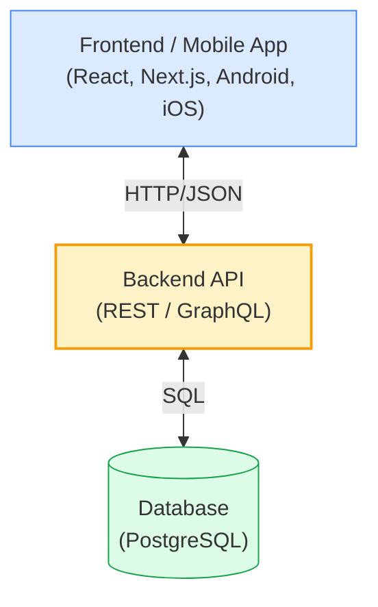
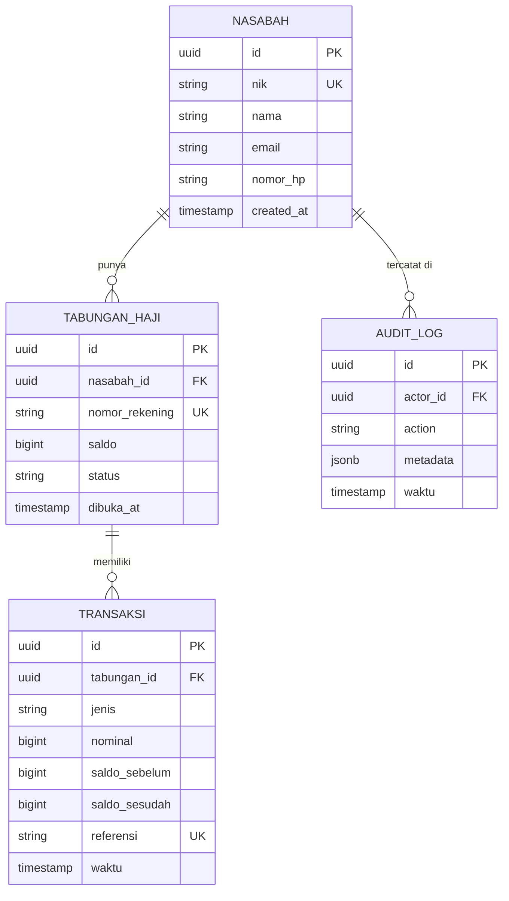
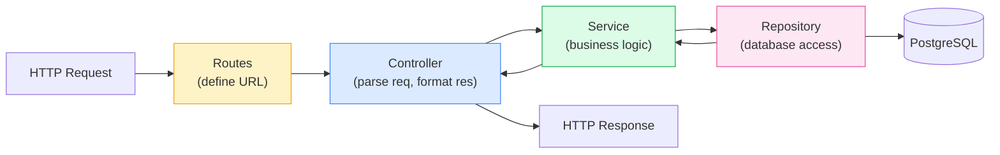

# Modul 2 — RESTful API & Database Modeling (PostgreSQL)

> **Hari ke-2 ODP BSI IT Development**. Setelah memahami SDLC, Agile, dan basic Cursor IDE di Modul 1, hari ini Anda membangun **layer data** dan **layer API** dari sistem perbankan — fondasi semua aplikasi backend di BSI.

> Setelah modul ini Anda harus bisa: (a) merancang skema database PostgreSQL untuk kasus perbankan, (b) menerapkan prinsip REST API yang benar, (c) membangun endpoint CRUD lengkap dengan Node.js + Express + TypeScript, (d) memanfaatkan Cursor IDE untuk auto-generate endpoint dari skema database.

---

## 1. Pengantar — Layer Backend di Sistem Perbankan

Setiap aplikasi modern dibagi menjadi tiga **layer utama**:



Di Modul 2 kita fokus ke **dua layer bawah**: Database (PostgreSQL) + Backend API (Node.js/Express). Frontend dibahas di Modul 3.

### Studi Kasus Berlanjut: Sistem Tabungan Haji BSI

Kita lanjutkan kasus dari Modul 1 — bikin **REST API untuk Tabungan Haji**:
- Nasabah bisa daftar tabungan haji.
- Nasabah bisa setor saldo.
- Nasabah bisa lihat mutasi.
- Admin bisa lihat semua transaksi.

---

## 2. RESTful API — Konsep Dasar

**REST** (Representational State Transfer) adalah arsitektur API yang paling dominan di industri (~80% API publik pakai REST).

### 2.1 Enam Prinsip REST

| Prinsip | Penjelasan |
|---|---|
| **Client-Server** | Client dan server terpisah, komunikasi via HTTP |
| **Stateless** | Server tidak menyimpan state client antar request — tiap request mandiri |
| **Cacheable** | Response harus bisa di-cache untuk efisiensi |
| **Uniform Interface** | Konsisten: URI, HTTP method, representasi resource |
| **Layered System** | Boleh ada layer antara client & server (load balancer, gateway, dll) |
| **Code on Demand** *(opsional)* | Server bisa kirim executable code (jarang dipakai) |

### 2.2 HTTP Methods (Verbs)

| Method | Idempotent? | Use case |
|---|---|---|
| **GET** | ✓ | Read data, tidak boleh mengubah state |
| **POST** | ✗ | Create resource baru, atau aksi non-idempotent |
| **PUT** | ✓ | Replace full resource |
| **PATCH** | ✓ | Update partial resource |
| **DELETE** | ✓ | Hapus resource |

**Idempotent** = panggil berkali-kali hasilnya sama. Penting di banking — kalau request setor di-retry karena timeout, jangan sampai saldo bertambah 2x.

### 2.3 HTTP Status Codes

Yang paling sering dipakai:

| Code | Kategori | Arti | Contoh |
|---|---|---|---|
| **200** | Success | OK | GET sukses |
| **201** | Success | Created | POST sukses |
| **204** | Success | No Content | DELETE sukses |
| **400** | Client error | Bad Request | Format JSON salah |
| **401** | Client error | Unauthorized | Token JWT tidak ada/invalid |
| **403** | Client error | Forbidden | Token valid, tapi tidak punya akses |
| **404** | Client error | Not Found | Resource tidak ada |
| **409** | Client error | Conflict | Duplikat data |
| **422** | Client error | Unprocessable Entity | Validasi gagal |
| **500** | Server error | Internal Server Error | Bug di server |
| **502/503** | Server error | Bad Gateway / Unavailable | Upstream service down |

### 2.4 Resource Naming Convention

Aturan emas: **resource = noun** (kata benda), **bukan verb**.

| ❌ Salah | ✅ Benar |
|---|---|
| `POST /createTabungan` | `POST /tabungan` |
| `GET /getNasabahById?id=1` | `GET /nasabah/1` |
| `POST /setorToTabungan` | `POST /tabungan/{id}/setor` |
| `GET /allTransaksi` | `GET /transaksi` |

Lebih lengkap untuk Tabungan Haji BSI:

```
GET    /api/v1/nasabah                      # list semua nasabah
GET    /api/v1/nasabah/{id}                 # detail nasabah
POST   /api/v1/nasabah                      # daftar nasabah baru
PATCH  /api/v1/nasabah/{id}                 # update data nasabah

GET    /api/v1/tabungan-haji                # list tabungan haji (filter by nasabah_id)
POST   /api/v1/tabungan-haji                # buka tabungan haji baru
GET    /api/v1/tabungan-haji/{id}           # detail tabungan
GET    /api/v1/tabungan-haji/{id}/mutasi    # mutasi tabungan
POST   /api/v1/tabungan-haji/{id}/setor     # setor saldo
POST   /api/v1/tabungan-haji/{id}/tarik     # tarik saldo (kalau diizinkan)
```

> **Versioning di URL**: pakai `/api/v1/...` supaya kalau ada breaking change, bisa rilis `/v2/` tanpa merusak client lama.

### 2.5 Anatomi Request & Response

**Request POST `/api/v1/tabungan-haji/PSTH-001/setor`:**

```http
POST /api/v1/tabungan-haji/PSTH-001/setor HTTP/1.1
Host: api.bsi.co.id
Authorization: Bearer eyJhbGc...
Content-Type: application/json
Idempotency-Key: a3f2-9b1d-7c4e

{
  "nominal": 500000,
  "metode": "QRIS",
  "referensi": "TRX-2026052301234"
}
```

**Response sukses (201 Created):**

```http
HTTP/1.1 201 Created
Content-Type: application/json

{
  "data": {
    "transaksi_id": "TRX-001",
    "tabungan_id": "PSTH-001",
    "nominal": 500000,
    "saldo_sebelum": 2500000,
    "saldo_sesudah": 3000000,
    "waktu": "2026-05-23T14:30:00+07:00"
  }
}
```

**Response error (422):**

```json
{
  "error": {
    "code": "VALIDATION_ERROR",
    "message": "Setoran minimum Rp 100.000",
    "field": "nominal"
  }
}
```

---

## 3. Database Modeling — Dasar

Sebelum bikin API, **rancang dulu database**-nya. Salah desain database → API ikut salah → susah refactor di kemudian hari.

### 3.1 ERD (Entity Relationship Diagram)

ERD memvisualisasikan tabel + relasi antar tabel.



**Notasi**:
- `||--o{` = one-to-many (1 nasabah punya banyak tabungan)
- `PK` = Primary Key
- `FK` = Foreign Key
- `UK` = Unique Key

### 3.2 Tiga Bentuk Relasi

| Relasi | Contoh | Implementasi |
|---|---|---|
| **1:1** | Nasabah ↔ KTP | FK di salah satu tabel |
| **1:N** (one-to-many) | Nasabah ↔ Tabungan Haji | FK di sisi N (tabungan) |
| **M:N** (many-to-many) | Nasabah ↔ Produk Bank | Junction table (nasabah_produk) |

### 3.3 Normalisasi (Singkat)

Tujuan: hindari duplikasi & inkonsistensi data.

| Bentuk | Aturan | Contoh anti-pattern |
|---|---|---|
| **1NF** | Tiap kolom atomic (tidak ada list) | Kolom `produk_dimiliki` berisi "Tabungan,Deposito,KPR" |
| **2NF** | 1NF + tidak ada partial dependency | Composite key, kolom hanya bergantung pada sebagian key |
| **3NF** | 2NF + tidak ada transitive dependency | Tabel transaksi punya `nama_nasabah` (harusnya cukup `nasabah_id`) |

Untuk modul ini, fokus ke **3NF** — cukup untuk 90% kasus.

### 3.4 Constraint Penting

| Constraint | Fungsi | Contoh |
|---|---|---|
| `PRIMARY KEY` | ID unik tiap baris | `id UUID PRIMARY KEY` |
| `FOREIGN KEY` | Referensi ke tabel lain | `nasabah_id UUID REFERENCES nasabah(id)` |
| `UNIQUE` | Tidak boleh duplikat | `email VARCHAR UNIQUE` |
| `NOT NULL` | Wajib diisi | `nama VARCHAR NOT NULL` |
| `CHECK` | Aturan custom | `CHECK (saldo >= 0)` |
| `DEFAULT` | Nilai default | `created_at TIMESTAMP DEFAULT NOW()` |

### 3.5 Index — Untuk Performance

Index = "daftar isi" tabel — query lebih cepat tapi insert/update sedikit lebih lambat.

**Aturan kapan bikin index**:
- ✅ Kolom yang sering di-filter di `WHERE` (mis. `email`, `nik`).
- ✅ Kolom yang sering di-JOIN.
- ✅ Foreign key (otomatis di banyak ORM).
- ❌ Kolom yang sering berubah (overhead lebih besar dari benefit).
- ❌ Tabel kecil (< 1000 baris) — full scan sudah cepat.

```sql
CREATE INDEX idx_transaksi_tabungan_waktu
ON transaksi (tabungan_id, waktu DESC);
```

---

## 4. PostgreSQL — Pengenalan

**PostgreSQL** (sering disebut "Postgres") adalah RDBMS open-source paling powerful & matang. Dipakai banyak fintech & bank besar — termasuk banyak sistem di BSI.

### 4.1 Kenapa PostgreSQL?

| Fitur | Manfaat untuk banking |
|---|---|
| **ACID compliance** | Transaksi atomic — kritis untuk perpindahan saldo |
| **JSON/JSONB native** | Simpan metadata fleksibel tanpa pindah ke NoSQL |
| **Foreign Data Wrapper** | Connect ke sistem legacy (Oracle, MySQL) |
| **Row-level security** | Akses data per-user/per-row |
| **Open source** | Tanpa license fee, vendor-independent |
| **Extensions** | PostGIS, pgcrypto, dll |

### 4.2 Setup Cepat dengan Docker

Cara paling cepat — tanpa install ribet:

```bash
docker run --name pg-bsi \
  -e POSTGRES_PASSWORD=rahasiabsi123 \
  -e POSTGRES_DB=tabungan_haji \
  -p 5432:5432 \
  -d postgres:16
```

Lalu connect via `psql`:

```bash
docker exec -it pg-bsi psql -U postgres -d tabungan_haji
```

> Detail Docker dibahas di **Modul 5**. Untuk sekarang cukup paham bahwa Docker memudahkan setup database tanpa "polusi" install global.

### 4.3 Tipe Data Penting

| Tipe | Penggunaan | Contoh |
|---|---|---|
| `UUID` | ID unik global | `id UUID DEFAULT gen_random_uuid()` |
| `VARCHAR(n)` | String variable | `nama VARCHAR(100)` |
| `TEXT` | String panjang | `deskripsi TEXT` |
| `BIGINT` | Bilangan bulat besar | `saldo BIGINT` (cocok untuk Rupiah) |
| `NUMERIC(p,s)` | Desimal presisi tinggi | `bagi_hasil NUMERIC(15,2)` |
| `BOOLEAN` | true/false | `is_aktif BOOLEAN DEFAULT TRUE` |
| `DATE` | Tanggal | `tanggal_lahir DATE` |
| `TIMESTAMPTZ` | Tanggal + waktu + timezone | `waktu TIMESTAMPTZ DEFAULT NOW()` |
| `JSONB` | JSON binary (indexable) | `metadata JSONB` |

> **Penting untuk uang**: jangan pakai `FLOAT` atau `DOUBLE` — presisi tidak akurat (klasik bug: `0.1 + 0.2 = 0.30000000000000004`). Pakai `BIGINT` (simpan dalam sen/rupiah penuh) atau `NUMERIC` (decimal precision).

---

## 5. Schema Design — Tabungan Haji

Implementasi konkret ERD di §3.1:

```sql
-- Aktifkan extension UUID
CREATE EXTENSION IF NOT EXISTS "pgcrypto";

-- Tabel Nasabah
CREATE TABLE nasabah (
    id           UUID PRIMARY KEY DEFAULT gen_random_uuid(),
    nik          VARCHAR(16) UNIQUE NOT NULL,
    nama         VARCHAR(100) NOT NULL,
    email        VARCHAR(150) UNIQUE NOT NULL,
    nomor_hp     VARCHAR(20) NOT NULL,
    created_at   TIMESTAMPTZ DEFAULT NOW(),
    updated_at   TIMESTAMPTZ DEFAULT NOW()
);

CREATE INDEX idx_nasabah_email ON nasabah(email);
CREATE INDEX idx_nasabah_nik ON nasabah(nik);

-- Tabel Tabungan Haji
CREATE TABLE tabungan_haji (
    id              UUID PRIMARY KEY DEFAULT gen_random_uuid(),
    nasabah_id      UUID NOT NULL REFERENCES nasabah(id) ON DELETE RESTRICT,
    nomor_rekening  VARCHAR(20) UNIQUE NOT NULL,
    saldo           BIGINT NOT NULL DEFAULT 0 CHECK (saldo >= 0),
    status          VARCHAR(20) NOT NULL DEFAULT 'AKTIF'
                    CHECK (status IN ('AKTIF', 'BEKU', 'TUTUP')),
    dibuka_at       TIMESTAMPTZ DEFAULT NOW(),
    created_at      TIMESTAMPTZ DEFAULT NOW()
);

CREATE INDEX idx_tabungan_nasabah ON tabungan_haji(nasabah_id);

-- Tabel Transaksi
CREATE TABLE transaksi (
    id              UUID PRIMARY KEY DEFAULT gen_random_uuid(),
    tabungan_id     UUID NOT NULL REFERENCES tabungan_haji(id) ON DELETE RESTRICT,
    jenis           VARCHAR(20) NOT NULL
                    CHECK (jenis IN ('SETOR', 'TARIK', 'BAGI_HASIL', 'BIAYA_ADMIN')),
    nominal         BIGINT NOT NULL CHECK (nominal > 0),
    saldo_sebelum   BIGINT NOT NULL,
    saldo_sesudah   BIGINT NOT NULL,
    referensi       VARCHAR(50) UNIQUE NOT NULL,    -- idempotency key
    metode          VARCHAR(20),                     -- QRIS, ATM, TELLER, dll
    waktu           TIMESTAMPTZ DEFAULT NOW()
);

CREATE INDEX idx_transaksi_tabungan_waktu
ON transaksi(tabungan_id, waktu DESC);

CREATE INDEX idx_transaksi_referensi
ON transaksi(referensi);

-- Tabel Audit Log (untuk compliance)
CREATE TABLE audit_log (
    id          UUID PRIMARY KEY DEFAULT gen_random_uuid(),
    actor_id    UUID,                          -- siapa yang melakukan (nasabah/admin)
    action      VARCHAR(50) NOT NULL,          -- mis. 'SETOR_TABUNGAN'
    entity      VARCHAR(50) NOT NULL,          -- mis. 'tabungan_haji'
    entity_id   UUID,
    metadata    JSONB,                          -- detail bebas
    waktu       TIMESTAMPTZ DEFAULT NOW()
);

CREATE INDEX idx_audit_waktu ON audit_log(waktu DESC);
CREATE INDEX idx_audit_action ON audit_log(action);
```

### 5.1 Insert Sample Data

```sql
-- Sample nasabah
INSERT INTO nasabah (nik, nama, email, nomor_hp) VALUES
('3173052501800001', 'Sari Wulandari', 'sari@email.com', '081234567890'),
('3173052501800002', 'Budi Pratama',   'budi@email.com', '081234567891'),
('3173052501800003', 'Tina Sari',      'tina@email.com', '081234567892');

-- Sample tabungan haji
INSERT INTO tabungan_haji (nasabah_id, nomor_rekening, saldo)
SELECT id, '7011' || LPAD((row_number() OVER ())::text, 8, '0'), 0
FROM nasabah;
```

---

## 6. Migrations — Version Control untuk Schema

**Migration** = file SQL/code yang merepresentasikan satu perubahan schema, di-version-kan di Git. Tujuannya: schema database bisa di-reproduce di semua environment (dev, staging, prod).

### 6.1 Kenapa Bukan SQL Langsung?

| Tanpa migration | Dengan migration |
|---|---|
| Tiap dev edit schema sendiri-sendiri | Schema change masuk Git, di-review |
| Schema dev ≠ schema staging ≠ prod | Semua env pakai migration yang sama |
| Rollback = manual scan SQL | Rollback = `migrate down` |
| Audit perubahan susah | Tiap perubahan punya file & timestamp |

### 6.2 Pilihan Tool Migration

| Tool | Stack |
|---|---|
| **Knex.js** | Node.js generic |
| **TypeORM** | TypeScript + decorators |
| **Prisma** *(populer 2024+)* | TypeScript + schema declarative |
| **Flyway / Liquibase** | Java ecosystem |
| **Alembic** | Python |

Untuk modul ini kita pakai **Prisma** (paling enak buat fresh project di Node.js).

### 6.3 Contoh: Migration dengan Prisma

`prisma/schema.prisma`:

```prisma
generator client {
  provider = "prisma-client-js"
}

datasource db {
  provider = "postgresql"
  url      = env("DATABASE_URL")
}

model Nasabah {
  id           String         @id @default(uuid())
  nik          String         @unique @db.VarChar(16)
  nama         String         @db.VarChar(100)
  email        String         @unique @db.VarChar(150)
  nomorHp      String         @map("nomor_hp") @db.VarChar(20)
  tabungan     TabunganHaji[]
  createdAt    DateTime       @default(now()) @map("created_at")
  updatedAt    DateTime       @updatedAt @map("updated_at")

  @@map("nasabah")
}

model TabunganHaji {
  id              String      @id @default(uuid())
  nasabahId       String      @map("nasabah_id")
  nasabah         Nasabah     @relation(fields: [nasabahId], references: [id])
  nomorRekening   String      @unique @map("nomor_rekening") @db.VarChar(20)
  saldo           BigInt      @default(0)
  status          String      @default("AKTIF") @db.VarChar(20)
  dibukaAt        DateTime    @default(now()) @map("dibuka_at")
  transaksi       Transaksi[]

  @@map("tabungan_haji")
}

model Transaksi {
  id             String       @id @default(uuid())
  tabunganId     String       @map("tabungan_id")
  tabungan       TabunganHaji @relation(fields: [tabunganId], references: [id])
  jenis          String       @db.VarChar(20)
  nominal        BigInt
  saldoSebelum   BigInt       @map("saldo_sebelum")
  saldoSesudah   BigInt       @map("saldo_sesudah")
  referensi      String       @unique @db.VarChar(50)
  metode         String?      @db.VarChar(20)
  waktu          DateTime     @default(now())

  @@index([tabunganId, waktu(sort: Desc)])
  @@map("transaksi")
}
```

Jalankan:

```bash
npx prisma migrate dev --name init   # generate migration + apply
npx prisma generate                  # generate type-safe client
```

---

## 7. Implementasi REST API — Node.js + Express + TypeScript

### 7.1 Setup Project

```bash
mkdir tabungan-haji-api && cd tabungan-haji-api
npm init -y
npm install express cors helmet zod
npm install -D typescript @types/express @types/node @types/cors ts-node nodemon
npx tsc --init
```

Update `tsconfig.json`:
```json
{
  "compilerOptions": {
    "target": "ES2022",
    "module": "commonjs",
    "strict": true,
    "esModuleInterop": true,
    "outDir": "./dist",
    "rootDir": "./src",
    "moduleResolution": "node"
  }
}
```

### 7.2 Struktur Folder — Clean Architecture

```
tabungan-haji-api/
├── prisma/
│   └── schema.prisma
├── src/
│   ├── index.ts                    ← entry point
│   ├── config/
│   │   └── env.ts                  ← validasi env var
│   ├── modules/
│   │   ├── nasabah/
│   │   │   ├── nasabah.routes.ts   ← define endpoint
│   │   │   ├── nasabah.controller.ts ← handle HTTP req/res
│   │   │   ├── nasabah.service.ts  ← business logic
│   │   │   └── nasabah.schema.ts   ← Zod validation
│   │   └── tabungan-haji/
│   │       ├── tabungan.routes.ts
│   │       ├── tabungan.controller.ts
│   │       ├── tabungan.service.ts
│   │       └── tabungan.schema.ts
│   ├── middleware/
│   │   ├── auth.ts                 ← JWT auth
│   │   └── error-handler.ts
│   └── lib/
│       ├── prisma.ts               ← Prisma client singleton
│       └── audit.ts                ← helper audit log
├── package.json
└── tsconfig.json
```

### 7.3 Pola Controller-Service-Repository



| Layer | Tanggung jawab | Yang TIDAK boleh dilakukan |
|---|---|---|
| **Routes** | Map URL → controller | Business logic, query DB |
| **Controller** | Parse request, validasi, panggil service, format response | Akses DB langsung |
| **Service** | Business logic, orkestrasi multi-repo | Tahu detail HTTP (req/res) |
| **Repository** | Query database | Business logic |

### 7.4 Contoh Implementasi — `POST /tabungan-haji/{id}/setor`

**Schema (Zod validation):**

```typescript
// src/modules/tabungan-haji/tabungan.schema.ts
import { z } from "zod";

export const setorSchema = z.object({
  nominal: z.number().int().min(100000, "Minimum setor Rp 100.000"),
  metode: z.enum(["QRIS", "ATM", "TELLER", "TRANSFER"]),
  referensi: z.string().min(1, "Referensi wajib (idempotency)")
});

export type SetorInput = z.infer<typeof setorSchema>;
```

**Service (business logic):**

```typescript
// src/modules/tabungan-haji/tabungan.service.ts
import { prisma } from "../../lib/prisma";
import { catatAudit } from "../../lib/audit";
import { SetorInput } from "./tabungan.schema";

export async function setorTabungan(
  tabunganId: string,
  input: SetorInput,
  actorId: string
) {
  // Idempotency check
  const existing = await prisma.transaksi.findUnique({
    where: { referensi: input.referensi }
  });
  if (existing) {
    return existing;   // sudah pernah diproses, return yang sama
  }

  // Transaction supaya atomik: update saldo + insert transaksi + audit log
  return await prisma.$transaction(async (tx) => {
    const tabungan = await tx.tabunganHaji.findUnique({
      where: { id: tabunganId }
    });
    if (!tabungan) throw new Error("Tabungan tidak ditemukan");
    if (tabungan.status !== "AKTIF") throw new Error("Tabungan tidak aktif");

    const saldoSebelum = tabungan.saldo;
    const saldoSesudah = saldoSebelum + BigInt(input.nominal);

    // Update saldo
    await tx.tabunganHaji.update({
      where: { id: tabunganId },
      data: { saldo: saldoSesudah }
    });

    // Insert transaksi
    const transaksi = await tx.transaksi.create({
      data: {
        tabunganId,
        jenis: "SETOR",
        nominal: BigInt(input.nominal),
        saldoSebelum,
        saldoSesudah,
        referensi: input.referensi,
        metode: input.metode
      }
    });

    // Audit log
    await catatAudit(tx, {
      actorId,
      action: "SETOR_TABUNGAN",
      entity: "tabungan_haji",
      entityId: tabunganId,
      metadata: { nominal: input.nominal, metode: input.metode }
    });

    return transaksi;
  });
}
```

**Controller (HTTP layer):**

```typescript
// src/modules/tabungan-haji/tabungan.controller.ts
import { Request, Response, NextFunction } from "express";
import { setorSchema } from "./tabungan.schema";
import { setorTabungan } from "./tabungan.service";

export async function handleSetor(req: Request, res: Response, next: NextFunction) {
  try {
    const tabunganId = req.params.id;
    const input = setorSchema.parse(req.body);    // throw kalau invalid
    const actorId = req.user!.id;                  // dari JWT middleware

    const transaksi = await setorTabungan(tabunganId, input, actorId);

    res.status(201).json({ data: transaksi });
  } catch (err) {
    next(err);
  }
}
```

**Routes:**

```typescript
// src/modules/tabungan-haji/tabungan.routes.ts
import { Router } from "express";
import { authJwt } from "../../middleware/auth";
import { handleSetor } from "./tabungan.controller";

const router = Router();
router.post("/:id/setor", authJwt, handleSetor);

export default router;
```

---

## 8. Auto-Generate Endpoint dengan Cursor IDE

Sekarang bagian seru: **manfaatkan AI** untuk mempercepat development.

### 8.1 Pola Prompt — Generate CRUD dari Schema

Setelah `prisma/schema.prisma` ditulis, **paste schema + minta Cursor generate CRUD endpoint**:

```
Konteks: Saya pakai Express + TypeScript + Prisma + Zod.
Struktur project saya pakai pola Controller-Service-Schema (lihat tabungan-haji/).

Tugas: Berdasarkan model Prisma di bawah, generate:
1. <module>.schema.ts — Zod schema untuk Create, Update, Query
2. <module>.service.ts — function untuk findAll, findById, create, update, delete
3. <module>.controller.ts — Express handler untuk masing-masing
4. <module>.routes.ts — define endpoint REST

Aturan:
- Semua handler async + try/catch + next(err).
- Validasi pakai Zod (parse di controller).
- Service hanya touch Prisma — tidak tahu Express.
- Pakai konvensi naming sama dengan modul tabungan-haji.

Model:
[paste model dari schema.prisma]
```

AI akan generate 4 file lengkap. Anda tinggal **review & refine**.

### 8.2 Iterative Refinement

Setelah generate awal, refine dengan prompt lanjutan:

```
Tambahkan:
1. Pagination di findAll (?page=1&limit=20).
2. Filter by email di findAll (?email=sari@...).
3. Soft delete (set is_deleted=true) instead of hard delete.
```

```
Tambahkan audit log di semua mutation (create, update, delete).
Pakai helper catatAudit() yang sudah ada di lib/audit.ts.
```

### 8.3 Tab Autocomplete untuk Speed

Saat menulis service, mulai ketik:
```typescript
export async function update
```
Cursor akan auto-suggest function signature lengkap dengan parameter, validasi, dan Prisma call — berdasarkan pattern yang sudah ada di file lain.

### 8.4 Inline Edit (Cmd+K) untuk Refactor

Highlight kode → Cmd+K → ketik instruksi:

```
"Ekstrak validasi nominal ini ke helper function di lib/validation.ts"
"Ubah ini supaya pakai database transaction"
"Tambahkan rate limiting untuk endpoint ini"
```

---

## 9. Authentication & Authorization

### 9.1 JWT (JSON Web Token) Singkat

```
[HEADER].[PAYLOAD].[SIGNATURE]

eyJhbGciOiJIUzI1NiIsInR5cCI6IkpXVCJ9.
eyJzdWIiOiJ1c2VyLTEyMyIsIm5hbWEiOiJTYXJpIiwiZXhwIjoxNzM...}.
SflKxwRJSMeKKF2QT4fwpMeJf36POk6yJV_adQssw5c
```

**Header**: algoritma signing (HS256, RS256).
**Payload**: data user (id, role, exp).
**Signature**: signed dengan secret key — verify integrity.

### 9.2 Middleware JWT

```typescript
// src/middleware/auth.ts
import jwt from "jsonwebtoken";
import { Request, Response, NextFunction } from "express";

declare global {
  namespace Express {
    interface Request { user?: { id: string; role: string; }; }
  }
}

export function authJwt(req: Request, res: Response, next: NextFunction) {
  const header = req.headers.authorization;
  if (!header?.startsWith("Bearer ")) {
    return res.status(401).json({ error: { code: "UNAUTHORIZED", message: "Token tidak ada" }});
  }

  try {
    const token = header.slice(7);
    const decoded = jwt.verify(token, process.env.JWT_SECRET!) as { id: string; role: string };
    req.user = decoded;
    next();
  } catch {
    res.status(401).json({ error: { code: "INVALID_TOKEN", message: "Token tidak valid" }});
  }
}
```

### 9.3 Role-based Authorization

```typescript
export function requireRole(...roles: string[]) {
  return (req: Request, res: Response, next: NextFunction) => {
    if (!req.user || !roles.includes(req.user.role)) {
      return res.status(403).json({ error: { code: "FORBIDDEN", message: "Akses ditolak" }});
    }
    next();
  };
}

// Pakai:
router.delete("/:id", authJwt, requireRole("ADMIN"), handleDelete);
```

---

## 10. Testing API

### 10.1 Manual Test — cURL

```bash
# Daftar nasabah
curl -X POST http://localhost:3000/api/v1/nasabah \
  -H "Content-Type: application/json" \
  -d '{"nik":"3173052501800099","nama":"Test","email":"test@x.id","nomor_hp":"08123"}'

# Setor (perlu token)
curl -X POST http://localhost:3000/api/v1/tabungan-haji/PSTH-001/setor \
  -H "Authorization: Bearer eyJhbGc..." \
  -H "Content-Type: application/json" \
  -d '{"nominal":500000,"metode":"QRIS","referensi":"TRX-001"}'
```

### 10.2 Postman / Thunder Client

GUI yang lebih nyaman untuk explore API:
- **Postman**: standalone app, paling populer.
- **Thunder Client**: extension VS Code/Cursor, ringan.

Bikin **Collection** per endpoint, simpan environment variable (URL, token).

### 10.3 Automated Test

Bahas mendalam di **Modul 4** (unit & integration testing).

---

## 11. Dokumentasi API — OpenAPI/Swagger

API tanpa dokumentasi = API yang tidak dipakai orang. Pakai **OpenAPI** (dulu Swagger):

```typescript
// pakai package: @scalar/express-api-reference + swagger-jsdoc
/**
 * @openapi
 * /tabungan-haji/{id}/setor:
 *   post:
 *     summary: Setor saldo ke tabungan haji
 *     parameters:
 *       - in: path
 *         name: id
 *         required: true
 *     requestBody:
 *       required: true
 *       content:
 *         application/json:
 *           schema:
 *             type: object
 *             properties:
 *               nominal: { type: integer, minimum: 100000 }
 *               metode: { type: string, enum: [QRIS, ATM, TELLER] }
 *               referensi: { type: string }
 *     responses:
 *       201:
 *         description: Berhasil setor
 *       422:
 *         description: Validasi gagal
 */
```

Akses docs UI di `http://localhost:3000/docs` setelah setup.

---

## 12. Banking-Specific Concerns

### 12.1 Idempotency

**Skenario**: nasabah klik "Setor" 2x karena ragu. Aplikasi kirim 2 request. Kalau tidak idempotent → saldo bertambah 2x.

**Solusi**: client kirim `Idempotency-Key` (UUID). Server cek di DB: kalau sudah ada → return result yang sama, tidak proses ulang.

Implementasi sudah ada di §7.4 — kolom `referensi UNIQUE` di tabel `transaksi`.

### 12.2 Database Transaction (ACID)

**Skenario**: setor saldo = update tabel `tabungan_haji` + insert ke `transaksi` + insert `audit_log`. Kalau salah satu gagal di tengah → data inkonsisten.

**Solusi**: bungkus dalam **DB transaction** (`prisma.$transaction(...)`). Semua atau tidak sama sekali.

### 12.3 Audit Trail

Regulasi OJK Syariah mewajibkan **audit trail** untuk semua perubahan saldo. Sudah dimodelkan di tabel `audit_log`.

Best practice:
- Catat **siapa, kapan, apa yang berubah**.
- Field `metadata` JSONB untuk fleksibilitas.
- **Append-only** — tidak boleh update/delete audit log.

### 12.4 Rate Limiting

Cegah abuse: maksimal 100 request/menit per user.

```typescript
import rateLimit from "express-rate-limit";

const limiter = rateLimit({
  windowMs: 60 * 1000,
  max: 100,
  message: { error: { code: "RATE_LIMIT", message: "Terlalu banyak request" } }
});

app.use("/api", limiter);
```

### 12.5 Input Sanitization

**JANGAN PERNAH** concat user input ke SQL:

```typescript
// ❌ SQL injection vulnerability
db.query(`SELECT * FROM nasabah WHERE email = '${userInput}'`);

// ✓ Parameterized query
db.query("SELECT * FROM nasabah WHERE email = $1", [userInput]);

// ✓ Pakai ORM (Prisma)
prisma.nasabah.findFirst({ where: { email: userInput } });
```

---

## 13. Studi Kasus — Build Tabungan Haji API End-to-End

Workflow lengkap di hari ke-2:

| Step | Aktivitas | Tool |
|---|---|---|
| 1 | Design ERD (sesuai §3.1) | dbdiagram.io / pen & paper |
| 2 | Setup Postgres via Docker | Docker |
| 3 | Tulis `schema.prisma` (pakai prompt AI kalau perlu) | Cursor IDE |
| 4 | `npx prisma migrate dev --name init` | Terminal |
| 5 | Generate boilerplate Express + TypeScript | `npm init` + Cursor Composer |
| 6 | Implementasi modul Nasabah (CRUD lengkap) via Cursor | Cursor IDE |
| 7 | Implementasi modul Tabungan Haji (CRUD + endpoint setor) via Cursor | Cursor IDE |
| 8 | Tambah JWT auth | Cursor IDE |
| 9 | Test pakai Thunder Client / Postman | Thunder Client |
| 10 | Tambah dokumentasi OpenAPI | Cursor IDE |

**Target hari ke-2 selesai**: API jalan di `localhost:3000`, bisa daftar nasabah, buka tabungan, setor saldo, lihat mutasi — semua dengan validasi & audit log.

---

## 14. Penutup

### Yang harus Anda kuasai

**Konsep:**
- [ ] Paham 6 prinsip REST + HTTP methods + status codes.
- [ ] Bisa rancang ERD untuk kasus banking sederhana.
- [ ] Tahu beda 1:1, 1:N, M:N + cara implementasi-nya.
- [ ] Paham normalisasi sampai 3NF.

**PostgreSQL:**
- [ ] Setup Postgres via Docker.
- [ ] Bisa tulis `CREATE TABLE` dengan constraint (PK, FK, UNIQUE, CHECK).
- [ ] Tahu kapan bikin index.
- [ ] Paham tipe data untuk uang (BIGINT, bukan FLOAT).

**Express + TypeScript:**
- [ ] Bisa setup project + Prisma + migration.
- [ ] Paham pola Controller-Service.
- [ ] Bisa validasi input dengan Zod.
- [ ] Bisa implementasi JWT auth + role-based access.

**Cursor IDE:**
- [ ] Bisa pakai Composer untuk generate CRUD module dari schema.
- [ ] Bisa iterative refinement prompt.
- [ ] Bisa pakai Cmd+K untuk inline refactor.

**Banking-specific:**
- [ ] Paham idempotency + cara implementasi.
- [ ] Bisa bungkus operasi multi-table dalam DB transaction.
- [ ] Paham audit trail mandatory untuk perubahan saldo.

---

### Roadmap 5 Hari ODP BSI

| Hari | Modul | Topik |
|---|---|---|
| H1 | Modul 1 | SDLC, Agile & Setup Cursor IDE + Prompt Engineering |
| **H2** ← Anda di sini | **Modul 2** | **RESTful API & Database Modeling (PostgreSQL)** |
| H3 | Modul 3 | React/Next.js & Integrasi API — asistensi UI Component pakai Claude 3.5 Sonnet |
| H4 | Modul 4 | Prinsip SOLID & Clean Code + Automated Unit Testing — refactoring kode pakai AI |
| H5 | Modul 5 | Git Flow & Dockerizing Apps — best practice version control & containerisasi |

**Selanjutnya**: **Modul 3 — React/Next.js & Integrasi API**. Anda akan bikin UI yang konsumsi API yang barusan dibangun, dengan bantuan Claude 3.5 Sonnet untuk asistensi pembuatan UI Component.
