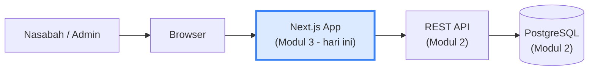

# Modul 3 — React/Next.js & Integrasi API

> **Hari ke-3 ODP BSI IT Development**. Di Modul 2 Anda membangun API Tabungan Haji. Hari ini Anda bikin **antarmuka** yang konsumsi API itu — versi web yang nasabah/admin akan lihat. Tool AI utama: **Claude Code Pro** — kombinasi Claude Desktop (untuk iterasi visual via Artifacts) dan Claude Code CLI (untuk generate file langsung ke project).

> Setelah modul ini Anda harus bisa: (a) memahami React (component, props, state, hooks), (b) bikin aplikasi Next.js dengan routing modern, (c) integrasi ke REST API dengan handling loading/error/success, (d) memanfaatkan Claude (via Desktop + CLI) untuk generate UI component berkualitas dengan prompt yang baik.

---

## 1. Pengantar — Layer Frontend dalam Sistem Perbankan



Frontend modern di BSI biasanya pakai **React** sebagai library UI utama, dengan **Next.js** sebagai framework di atasnya. Kombinasi ini standar industri (~40% website top dunia).

### 1.1 Mengapa React?

| Karakteristik | Manfaat |
|---|---|
| **Component-based** | UI dipecah jadi komponen kecil yang reusable |
| **Declarative** | "Apa yang harus tampil", bukan "bagaimana mencapainya" |
| **Virtual DOM** | Update UI efisien, hanya yang berubah yang re-render |
| **Ekosistem masif** | Library untuk hampir semua kebutuhan |
| **Job market besar** | Skill paling dicari di industri |

### 1.2 Mengapa Next.js?

React saja = library UI. Untuk app production butuh **framework** yang handle:
- Routing
- Server-side rendering (SEO)
- Image optimization
- API routes
- Build & deploy

**Next.js** menyediakan semua itu out-of-the-box.

---

## 2. React — Konsep Dasar

### 2.1 Component & JSX

**Component** = fungsi yang return UI. **JSX** = sintaks mirip HTML di dalam JavaScript.

```tsx
function KartuSaldo() {
  return (
    <div className="rounded-lg border p-4">
      <h2>Tabungan Haji</h2>
      <p>Saldo: Rp 5.000.000</p>
    </div>
  );
}

// Dipakai:
<KartuSaldo />
```

JSX bukan HTML — beberapa perbedaan:
- `class` → `className`
- `for` → `htmlFor`
- Style sebagai object: `style={{ color: "red" }}`
- Self-closing wajib: ``, `<br />`

### 2.2 Props — Pass Data ke Component

Props = parameter yang diterima component.

```tsx
type KartuSaldoProps = {
  nomorRekening: string;
  saldo: number;
};

function KartuSaldo({ nomorRekening, saldo }: KartuSaldoProps) {
  return (
    <div className="rounded-lg border p-4">
      <h2>Tabungan Haji {nomorRekening}</h2>
      <p>Saldo: Rp {saldo.toLocaleString("id-ID")}</p>
    </div>
  );
}

// Dipakai:
<KartuSaldo nomorRekening="70110001" saldo={5000000} />
```

### 2.3 State — Data yang Berubah

State = data internal component yang bisa berubah → trigger re-render.

```tsx
import { useState } from "react";

function FormSetor() {
  const [nominal, setNominal] = useState(0);

  return (
    <div>
      <input
        type="number"
        value={nominal}
        onChange={(e) => setNominal(Number(e.target.value))}
      />
      <button onClick={() => alert(`Setor Rp ${nominal}`)}>
        Setor
      </button>
    </div>
  );
}
```

**Aturan State**:
- Jangan modifikasi langsung: `nominal = 100` ❌ → `setNominal(100)` ✓
- Update bersifat **async** — jangan langsung baca setelah set.
- Untuk update yang bergantung state sebelumnya: `setNominal(prev => prev + 100)`.

### 2.4 Hooks — Function Khusus React

Hooks = function dari React yang dimulai dengan `use`. Yang paling sering dipakai:

| Hook | Fungsi |
|---|---|
| `useState` | State lokal component |
| `useEffect` | Side effect (fetch, subscription, dll) |
| `useRef` | Reference ke DOM element atau value yang tidak trigger re-render |
| `useMemo` | Memoize hasil kalkulasi mahal |
| `useCallback` | Memoize function reference |
| `useContext` | Konsumsi React Context |

### 2.5 useEffect — Fetch Data

```tsx
import { useState, useEffect } from "react";

function DaftarTabungan() {
  const [data, setData] = useState([]);
  const [loading, setLoading] = useState(true);

  useEffect(() => {
    fetch("/api/v1/tabungan-haji")
      .then((r) => r.json())
      .then((json) => {
        setData(json.data);
        setLoading(false);
      });
  }, []);   // [] = jalan sekali saat mount

  if (loading) return <p>Loading...</p>;

  return (
    <ul>
      {data.map((t) => <li key={t.id}>{t.nomorRekening}: Rp {t.saldo}</li>)}
    </ul>
  );
}
```

`[]` dependency array:
- `[]` = jalan sekali saat mount.
- `[var]` = jalan ketika `var` berubah.
- (tanpa array) = jalan setiap render — biasanya tidak diinginkan.

---

## 3. Next.js — Setup & Konsep

### 3.1 Setup Project

```bash
npx create-next-app@latest tabungan-haji-web --typescript --tailwind --app
cd tabungan-haji-web
npm run dev
```

Pilihan saat setup:
- TypeScript: **Yes** (industry standard sekarang).
- Tailwind CSS: **Yes** (styling utility-first).
- App Router: **Yes** (paradigma baru, recommended Next.js 13+).

Buka `http://localhost:3000` — app default sudah jalan.

### 3.2 File-based Routing (App Router)

Folder = route. File `page.tsx` = halaman.

```
app/
├── page.tsx                        → /
├── layout.tsx                      → layout global
├── tabungan/
│   ├── page.tsx                    → /tabungan
│   └── [id]/
│       ├── page.tsx                → /tabungan/PSTH-001
│       └── mutasi/
│           └── page.tsx            → /tabungan/PSTH-001/mutasi
└── api/
    └── proxy/
        └── route.ts                → /api/proxy (API route)
```

### 3.3 Rendering Strategy — Pilih yang Tepat

| Strategi | Kapan render | Use case |
|---|---|---|
| **Server Component** *(default Next.js 13+)* | Di server, kirim HTML | Halaman publik, dashboard read-only |
| **Client Component** *(`"use client"` di atas)* | Di browser, interaktif | Form, state, event handler |
| **Static (SSG)** | Saat build | Halaman tidak berubah-ubah (About, FAQ) |
| **ISR** | Re-generate periodik | Daftar produk, blog |
| **CSR (SPA-like)** | Sepenuhnya di browser | Admin dashboard |

Contoh Server Component (default):

```tsx
// app/tabungan/page.tsx
async function getTabungan() {
  const res = await fetch("http://localhost:3000/api/v1/tabungan-haji", {
    cache: "no-store"
  });
  return res.json();
}

export default async function HalamanTabungan() {
  const { data } = await getTabungan();

  return (
    <div>
      <h1>Tabungan Haji Anda</h1>
      <ul>
        {data.map((t) => (
          <li key={t.id}>{t.nomorRekening}: Rp {t.saldo}</li>
        ))}
      </ul>
    </div>
  );
}
```

Server Component bisa `async` langsung — fetch dijalankan di server, browser tinggal terima HTML jadi.

Client Component (kalau butuh interaksi):

```tsx
// app/tabungan/form-setor.tsx
"use client";

import { useState } from "react";

export default function FormSetor({ tabunganId }: { tabunganId: string }) {
  const [nominal, setNominal] = useState(0);
  const [loading, setLoading] = useState(false);

  async function handleSetor() {
    setLoading(true);
    const res = await fetch(`/api/v1/tabungan-haji/${tabunganId}/setor`, {
      method: "POST",
      headers: { "Content-Type": "application/json" },
      body: JSON.stringify({ nominal, metode: "QRIS", referensi: crypto.randomUUID() })
    });
    setLoading(false);
    if (res.ok) alert("Setor sukses!");
    else alert("Gagal");
  }

  return (
    <div className="flex gap-2">
      <input type="number" value={nominal} onChange={(e) => setNominal(+e.target.value)} />
      <button onClick={handleSetor} disabled={loading}>
        {loading ? "Memproses..." : "Setor"}
      </button>
    </div>
  );
}
```

---

## 4. Styling dengan Tailwind CSS

Tailwind = utility-first CSS framework. Style langsung di JSX pakai class.

```tsx
<div className="rounded-lg border bg-white p-6 shadow-sm hover:shadow-md transition">
  <h2 className="text-lg font-semibold text-gray-900">Tabungan Haji</h2>
  <p className="mt-2 text-2xl font-bold text-emerald-600">Rp 5.000.000</p>
</div>
```

**Keuntungan**:
- Tidak perlu pikirkan nama class CSS.
- Konsistensi otomatis (spacing, color palette).
- Bundle size kecil (purge yang tidak dipakai).

**Kelas paling sering dipakai**:

| Kategori | Contoh |
|---|---|
| Layout | `flex`, `grid`, `grid-cols-3`, `gap-4` |
| Spacing | `p-4` (padding), `m-2` (margin), `space-y-4` |
| Sizing | `w-full`, `h-screen`, `max-w-md` |
| Typography | `text-lg`, `font-bold`, `text-gray-700` |
| Color | `bg-emerald-600`, `text-white`, `border-gray-200` |
| Border | `rounded-lg`, `border`, `border-2` |
| State | `hover:bg-gray-100`, `focus:ring-2` |
| Responsive | `md:grid-cols-2`, `lg:flex-row` |

### 4.1 shadcn/ui — Component Library Modern

Daripada bikin button/dialog/form dari nol, pakai **shadcn/ui** — kumpulan komponen yang di-copy ke project Anda (bukan dependency), styling Tailwind.

```bash
npx shadcn@latest init
npx shadcn@latest add button input card dialog
```

Pakai:
```tsx
import { Button } from "@/components/ui/button";
import { Card, CardHeader, CardContent } from "@/components/ui/card";

<Card>
  <CardHeader>Tabungan Haji</CardHeader>
  <CardContent>
    <p>Saldo: Rp 5.000.000</p>
    <Button>Setor</Button>
  </CardContent>
</Card>
```

---

## 5. API Integration — Strategi

### 5.1 Tiga Pendekatan Fetch Data

| Pendekatan | Cocok untuk |
|---|---|
| **fetch native + Server Component** | Initial load, data yang tidak sering berubah |
| **TanStack Query (React Query)** | Client-side: caching, refetch, optimistic update |
| **SWR** | Alternatif ringan untuk TanStack Query |

### 5.2 TanStack Query — Pola Recommended

Setup:
```bash
npm install @tanstack/react-query
```

Provider di `layout.tsx`:
```tsx
"use client";
import { QueryClient, QueryClientProvider } from "@tanstack/react-query";

const queryClient = new QueryClient();

export function Providers({ children }: { children: React.ReactNode }) {
  return <QueryClientProvider client={queryClient}>{children}</QueryClientProvider>;
}
```

Pakai di component:
```tsx
"use client";
import { useQuery } from "@tanstack/react-query";

function DaftarTabungan() {
  const { data, isLoading, error } = useQuery({
    queryKey: ["tabungan"],
    queryFn: async () => {
      const res = await fetch("/api/v1/tabungan-haji");
      if (!res.ok) throw new Error("Gagal load data");
      return res.json();
    }
  });

  if (isLoading) return <p>Loading...</p>;
  if (error) return <p>Error: {error.message}</p>;

  return (
    <ul>
      {data.data.map((t) => <li key={t.id}>{t.nomorRekening}</li>)}
    </ul>
  );
}
```

**Keuntungan TanStack Query**:
- Auto cache & dedupe request.
- Refetch saat window focus.
- Loading & error state otomatis.
- Optimistic update untuk UX cepat.

### 5.3 Mutation (POST/PUT/DELETE)

```tsx
import { useMutation, useQueryClient } from "@tanstack/react-query";

function FormSetor({ tabunganId }: { tabunganId: string }) {
  const queryClient = useQueryClient();

  const setor = useMutation({
    mutationFn: async (input: { nominal: number; metode: string }) => {
      const res = await fetch(`/api/v1/tabungan-haji/${tabunganId}/setor`, {
        method: "POST",
        headers: { "Content-Type": "application/json" },
        body: JSON.stringify({ ...input, referensi: crypto.randomUUID() })
      });
      if (!res.ok) throw new Error("Setor gagal");
      return res.json();
    },
    onSuccess: () => {
      // Refresh data tabungan setelah setor sukses
      queryClient.invalidateQueries({ queryKey: ["tabungan"] });
    }
  });

  return (
    <button onClick={() => setor.mutate({ nominal: 500000, metode: "QRIS" })}>
      {setor.isPending ? "Memproses..." : "Setor Rp 500.000"}
    </button>
  );
}
```

---

## 6. Form Handling — React Hook Form + Zod

Form dengan validasi yang baik = mandatory di banking.

```bash
npm install react-hook-form @hookform/resolvers zod
```

```tsx
"use client";
import { useForm } from "react-hook-form";
import { zodResolver } from "@hookform/resolvers/zod";
import { z } from "zod";

const setorSchema = z.object({
  nominal: z.number().min(100000, "Minimum Rp 100.000"),
  metode: z.enum(["QRIS", "ATM", "TELLER"])
});

type SetorForm = z.infer<typeof setorSchema>;

export default function FormSetor() {
  const { register, handleSubmit, formState: { errors } } = useForm<SetorForm>({
    resolver: zodResolver(setorSchema)
  });

  function onSubmit(data: SetorForm) {
    console.log("Submit:", data);
    // panggil API setor di sini
  }

  return (
    <form onSubmit={handleSubmit(onSubmit)} className="space-y-4">
      <div>
        <label>Nominal</label>
        <input
          type="number"
          {...register("nominal", { valueAsNumber: true })}
          className="border rounded px-3 py-2"
        />
        {errors.nominal && <p className="text-red-600 text-sm">{errors.nominal.message}</p>}
      </div>

      <div>
        <label>Metode</label>
        <select {...register("metode")} className="border rounded px-3 py-2">
          <option value="QRIS">QRIS</option>
          <option value="ATM">ATM</option>
          <option value="TELLER">Teller</option>
        </select>
      </div>

      <button type="submit" className="bg-emerald-600 text-white px-4 py-2 rounded">
        Setor
      </button>
    </form>
  );
}
```

> **Catatan**: `Zod` schema yang sama bisa dipakai di backend (Modul 2 sudah pakai Zod) — konsistensi validasi client + server.

---

## 7. UI Component dengan Claude (Desktop + Code CLI)

Sekarang bagian highlight Modul 3: **Claude excel di generate UI component** karena paham desain modern, accessibility, dan komposisi.

### 7.1 Pilih Tool: Desktop atau CLI?

Untuk membuat UI component, dua-duanya bisa — pilih sesuai konteks:

| Skenario | Tool | Alasan |
|---|---|---|
| Iterasi visual rapid (preview block-by-block) | **Claude Desktop** | Artifacts: lihat preview component di sidebar sambil iterasi |
| Sketch component baru dari deskripsi text/wireframe | **Claude Desktop** | UX chat lebih nyaman untuk diskusi konseptual |
| Generate component langsung ke project file | **Claude Code CLI** | Otomatis create file di lokasi yang tepat (`components/...`) |
| Integrasi component baru ke route/page existing | **Claude Code CLI** | Bisa edit `app/page.tsx`, import component, update routing |
| Refactor component existing (styling tweak, prop change) | **Claude Code CLI** | Edit langsung file yang sudah ada |

> **Tip workflow**: pakai Desktop untuk **iterate visual** sampai dapat hasil yang oke, lalu copy hasil final ke project via Claude Code CLI.

### 7.2 Pola Prompt untuk UI Component

Pola **RCTF** dari Modul 1 tetap berlaku, dengan tambahan **spesifikasi visual**:

```
Role: Senior frontend engineer dengan spesialisasi React + Tailwind +
shadcn/ui untuk aplikasi banking.

Context:
- Project: dashboard nasabah BSI Mobile.
- Stack: Next.js 14 App Router + TypeScript + Tailwind + shadcn/ui.
- Design tone: clean, modern, professional banking (mirip BCA mobile / Jenius).
- Color theme: emerald-600 primary, slate gray neutrals.

Task:
Buatkan component <KartuTabungan /> yang menampilkan:
- Header: label "Tabungan Haji" + ikon kecil
- Body utama: saldo besar (format Rp dengan separator ribuan)
- Sub-info: nomor rekening + status (badge AKTIF/BEKU)
- Footer: 2 tombol kecil — "Setor" dan "Mutasi"
- Hover: card sedikit elevated (shadow lebih tinggi).

Props yang diterima:
- nomorRekening: string
- saldo: number (BigInt-safe)
- status: 'AKTIF' | 'BEKU' | 'TUTUP'
- onSetor: () => void
- onMutasi: () => void

Format output:
- Single file `kartu-tabungan.tsx`
- TypeScript strict
- Pakai shadcn Button, Card, Badge
- Beri komentar singkat di section utama
```

Claude akan generate component lengkap. Anda tinggal **review & integrate** ke project.

### 7.3 Iterative Refinement

Setelah generate awal:

```
Refine:
- Saldo: kalau > 10 juta, tampilkan dengan font lebih kecil supaya muat.
- Tambah ikon dari lucide-react (`ArrowDownToLine` untuk Setor, `History` untuk Mutasi).
- Saat status = BEKU, gray out card + disable tombol Setor.
- Tambah loading state: ada prop `isLoading`, render skeleton.
```

```
Konversi component ini supaya menerima prop `isOptimistic` (boolean).
Kalau true → tambah subtle border emerald untuk indikasi data belum konfirmasi dari server.
```

### 7.4 Dari Sketsa ke Code

Punya wireframe / mockup? Claude bisa terima **deskripsi text** wireframe:

```
Wireframe halaman Mutasi Tabungan:

┌────────────────────────────────────────┐
│  ← Mutasi Tabungan Haji        Filter ▾│
├────────────────────────────────────────┤
│  Saldo saat ini                         │
│  Rp 5.000.000                           │
├────────────────────────────────────────┤
│  23 Mei 2026, 14:30                     │
│  Setor via QRIS              + 500.000  │
│  Saldo: 5.000.000                       │
├────────────────────────────────────────┤
│  22 Mei 2026, 09:15                     │
│  Setor via Teller            + 200.000  │
│  Saldo: 4.500.000                       │
└────────────────────────────────────────┘

Bikin halaman ini di Next.js App Router, page nya di
app/tabungan/[id]/mutasi/page.tsx. Pakai TanStack Query
untuk fetch mutasi dari /api/v1/tabungan-haji/{id}/mutasi.
```

### 7.5 Generate Multi-File App Section

Pakai **Claude Code CLI** untuk generate multi-file sekaligus — Claude bisa create banyak file dalam satu sesi:

```
Generate folder structure + files untuk fitur "Setor Saldo" yang lengkap:

- app/tabungan/[id]/setor/page.tsx — halaman setor
- components/form-setor.tsx — form pakai react-hook-form + zod
- components/konfirmasi-setor.tsx — modal konfirmasi
- lib/api/tabungan.ts — function fetch ke API
- hooks/use-setor.ts — mutation hook pakai TanStack Query

Flow:
1. User isi nominal & pilih metode.
2. Klik "Setor" → munculkan modal konfirmasi.
3. Klik "Konfirmasi" → kirim ke API.
4. Loading state, lalu redirect ke halaman sukses.

Pakai pattern yang sudah ada di project (Tailwind + shadcn).
```

---

## 8. Authentication di Client

### 8.1 Penyimpanan Token JWT

| Tempat | Pro | Con |
|---|---|---|
| `localStorage` | Mudah, persist | XSS risk |
| `sessionStorage` | Auto-clear tab close | XSS risk |
| Cookie `httpOnly` | Aman dari XSS | Perlu setup di server |
| Memory (state) | Paling aman | Hilang saat refresh |

**Best practice untuk banking**: token disimpan di **cookie httpOnly** dengan flag `Secure` & `SameSite=Strict`. Frontend tidak akses langsung token — browser otomatis ikutkan di request.

### 8.2 Protected Route

```tsx
// middleware.ts (di root project)
import { NextResponse } from "next/server";
import type { NextRequest } from "next/server";

export function middleware(req: NextRequest) {
  const token = req.cookies.get("token")?.value;
  const isLogin = req.nextUrl.pathname === "/login";

  if (!token && !isLogin) {
    return NextResponse.redirect(new URL("/login", req.url));
  }

  return NextResponse.next();
}

export const config = {
  matcher: ["/((?!api|_next|login).*)"]
};
```

---

## 9. Studi Kasus — Mobile Banking UI Tabungan Haji

Build hari ke-3: aplikasi mini dengan halaman-halaman berikut.

### 9.1 Halaman yang Akan Dibangun

| URL | Halaman | Component utama |
|---|---|---|
| `/login` | Login | `<FormLogin />` |
| `/` | Dashboard | `<KartuTabungan />` × N, `<RingkasanSaldo />` |
| `/tabungan/[id]` | Detail tabungan | `<DetailTabungan />`, `<TombolAksi />` |
| `/tabungan/[id]/setor` | Setor saldo | `<FormSetor />`, `<KonfirmasiSetor />` |
| `/tabungan/[id]/mutasi` | Mutasi | `<DaftarMutasi />`, `<FilterMutasi />` |
| `/profil` | Profil nasabah | `<FormEditProfil />` |

### 9.2 Workflow Hari ke-3

| Step | Aktivitas | Tool |
|---|---|---|
| 1 | Setup Next.js project + Tailwind + shadcn | Terminal + Claude Code CLI |
| 2 | Setup TanStack Query + structure folder | Claude Code CLI |
| 3 | Sketch `<KartuTabungan />` visual (iterasi cepat) | Claude Desktop (Artifacts) |
| 4 | Copy final `<KartuTabungan />` ke project | Claude Code CLI |
| 5 | Bikin halaman Login + auth flow | Claude Code CLI |
| 6 | Bikin dashboard pakai data API Modul 2 | Claude Code CLI |
| 7 | Bikin form setor + integrasi API | Claude Code CLI |
| 8 | Bikin halaman mutasi dengan filter | Claude Code CLI |
| 9 | Polish: loading state, error handling, responsive | Claude Code CLI |

**Target hari ke-3 selesai**: aplikasi web Tabungan Haji jalan di `localhost:3001` (port beda dari API), full integrate dengan API Modul 2, looks professional.

---

## 10. Performance & Best Practices

### 10.1 Optimization Built-in Next.js

| Fitur | Manfaat |
|---|---|
| `<Image>` dari `next/image` | Otomatis lazy-load, optimize size, format AVIF/WebP |
| `<Link>` dari `next/link` | Prefetch halaman target saat di-hover |
| Server Components (default) | Less JS dikirim ke browser |
| `loading.tsx` per route | Loading state otomatis pakai React Suspense |
| `error.tsx` per route | Error boundary built-in |

### 10.2 Aturan Praktis

- **Default Server Component**, tambah `"use client"` cuma kalau perlu (form, state, event handler).
- **Code splitting** otomatis per route — jangan import library besar di shared module.
- **Image format**: WebP/AVIF (otomatis dari `next/image`).
- **Pakai font modern**: Inter, Geist Sans (auto via `next/font`).

### 10.3 Accessibility (a11y)

Banking app harus accessible:
- Pakai semantic HTML (`<button>` bukan `<div onClick>`).
- Label untuk form input (`<label htmlFor="nominal">`).
- Color contrast > 4.5:1 untuk teks.
- Test pakai screen reader (VoiceOver/NVDA).
- Aktifkan ESLint plugin `eslint-plugin-jsx-a11y`.

### 10.4 Banking-Specific UX

| Pola | Penjelasan |
|---|---|
| **Konfirmasi 2-step** untuk transaksi | Form input → modal review → submit |
| **Format Rupiah** konsisten | `Intl.NumberFormat('id-ID', { style: 'currency', currency: 'IDR' })` |
| **Mask data sensitif** | Nomor rekening: `7011****0001`, KTP: `3173****0001` |
| **Auto-logout** | Setelah 5 menit idle → redirect ke login |
| **Loading state untuk aksi** | Tombol disable + spinner saat submit |
| **Optimistic update** | UI langsung update saat klik, rollback kalau API gagal |

---

## 11. Penutup

### Yang harus Anda kuasai

**React Fundamentals:**
- [ ] Component, props, state.
- [ ] Hooks (useState, useEffect, useMemo).
- [ ] JSX syntax & rules.

**Next.js:**
- [ ] Setup project + Tailwind + shadcn.
- [ ] App Router & file-based routing.
- [ ] Server Component vs Client Component — kapan pakai mana.
- [ ] Loading & error state per route.
- [ ] Middleware untuk auth.

**API Integration:**
- [ ] Fetch data di Server Component dan Client Component.
- [ ] TanStack Query untuk caching & mutation.
- [ ] Handle loading, error, success state.
- [ ] React Hook Form + Zod untuk form & validasi.

**Claude Code Pro untuk UI:**
- [ ] Tahu kapan pakai Claude Desktop (iterate visual via Artifacts) vs Claude Code CLI (langsung ke project file).
- [ ] Prompt RCTF untuk UI component dengan spesifikasi visual.
- [ ] Iterative refinement.
- [ ] Generate multi-file feature lewat Claude Code CLI.

**Banking-specific:**
- [ ] Format Rupiah konsisten.
- [ ] Konfirmasi 2-step untuk transaksi.
- [ ] Mask data sensitif.
- [ ] Loading state untuk aksi sensitif.

---

### Roadmap 5 Hari ODP BSI

| Hari | Modul | Topik |
|---|---|---|
| H1 | Modul 1 | SDLC, Agile & Setup Claude Code Pro + Prompt Engineering |
| H2 | Modul 2 | RESTful API & Database Modeling (PostgreSQL) |
| **H3** ← Anda di sini | **Modul 3** | **React/Next.js & Integrasi API** |
| H4 | Modul 4 | Prinsip SOLID & Clean Code + Automated Unit Testing |
| H5 | Modul 5 | Git Flow & Dockerizing Apps |

**Selanjutnya**: **Modul 4 — Prinsip SOLID & Clean Code + Automated Unit Testing**. Kode Anda dari hari 2-3 akan di-review & refactor pakai prinsip SOLID, lalu di-cover dengan unit test.
