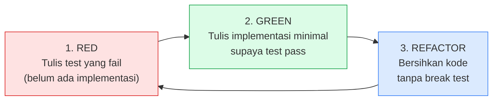

# Modul 4 — Prinsip SOLID & Clean Code + Automated Unit Testing

> **Hari ke-4 ODP BSI IT Development**. Setelah punya backend (Modul 2) dan frontend (Modul 3), hari ini Anda **angkat kualitas kode** ke level production-ready: refactor dengan prinsip SOLID, terapkan Clean Code, dan tutup dengan automated test. Tool AI utama: **Cursor IDE** untuk refactoring & generate test.

> Setelah modul ini Anda harus bisa: (a) mengenali code smells dan refactor-nya, (b) menerapkan 5 prinsip SOLID di kode TypeScript, (c) menulis unit test dengan Jest/Vitest, (d) memanfaatkan Cursor IDE untuk auto-generate test dari kode existing dan suggest refactoring.

---

## 1. Pengantar — Kenapa Kualitas Kode Penting di Banking

Bug di banking app berdampak **finansial langsung** — bisa dari salah saldo nasabah sampai compliance penalty regulasi. Kode banking dipelihara **bertahun-tahun**, sering ditangani developer berbeda. Kalau kodenya kotor:

| Tanpa Clean Code & Test | Dengan Clean Code & Test |
|---|---|
| Bug ditemukan saat produksi (mahal) | Bug ditemukan saat CI (murah) |
| Tiap perubahan kecil = risiko regresi | Refactor aman karena ada safety net |
| Onboarding developer baru 2-3 minggu | Onboarding seminggu |
| Audit OJK susah — kode tidak readable | Audit lancar — kode self-documenting |
| Tim takut sentuh kode lama | Tim percaya diri ubah apa saja |

**Aturan emas dari Robert C. Martin (penulis "Clean Code")**:
> "Kode dibaca 10x lebih sering dari ditulis. Optimasi untuk pembaca, bukan penulis."

---

## 2. Clean Code — Prinsip Dasar

### 2.1 Naming — Penamaan yang Bermakna

| Buruk | Baik |
|---|---|
| `const d = new Date();` | `const tanggalSetor = new Date();` |
| `function calc(x, y)` | `function hitungBagiHasilSyariah(saldo, nisbah)` |
| `let data;` | `let daftarMutasiTabungan;` |
| `if (s === 1)` | `if (status === STATUS_AKTIF)` |
| `arr.map(x => ...)` | `transaksiList.map(transaksi => ...)` |

**Aturan**:
- **Kata benda** untuk variabel & class.
- **Kata kerja** untuk function.
- **Boolean** prefiks `is`, `has`, `can`, `should`.
- **Hindari singkatan** ambigu (`tmp`, `mgr`, `acc`).
- **Konsisten**: kalau pakai `nasabah` jangan ada `customer` di tempat lain.

### 2.2 Function — Kecil & Satu Tugas

**Aturan**: function idealnya ≤ 20 baris, satu level abstraksi, melakukan **satu hal**.

**❌ Function gemuk** (multi-tugas, susah di-test):

```typescript
async function setorTabungan(req, res) {
  // 1. Validasi input
  if (!req.body.nominal || req.body.nominal < 100000) {
    return res.status(422).json({ error: "Minimum 100rb" });
  }

  // 2. Cek idempotency
  const existing = await db.transaksi.findOne({ referensi: req.body.referensi });
  if (existing) return res.json({ data: existing });

  // 3. Update saldo
  const tabungan = await db.tabungan.findById(req.params.id);
  const saldoBaru = tabungan.saldo + req.body.nominal;
  await db.tabungan.update({ id: req.params.id, saldo: saldoBaru });

  // 4. Insert transaksi
  const transaksi = await db.transaksi.create({...});

  // 5. Kirim email konfirmasi
  await emailService.send(tabungan.nasabah.email, "Setor sukses", ...);

  // 6. Audit log
  await db.auditLog.create({...});

  return res.status(201).json({ data: transaksi });
}
```

**✓ Function refactored** (terpisah per concern):

```typescript
// Controller — handle HTTP saja
async function handleSetor(req, res, next) {
  try {
    const input = setorSchema.parse(req.body);
    const transaksi = await setorTabungan(req.params.id, input, req.user.id);
    res.status(201).json({ data: transaksi });
  } catch (err) { next(err); }
}

// Service — orchestrate business logic
async function setorTabungan(tabunganId, input, actorId) {
  const existing = await cariByReferensi(input.referensi);
  if (existing) return existing;

  return await dbTransaction(async (tx) => {
    const tabungan = await ambilTabungan(tx, tabunganId);
    pastikanTabunganAktif(tabungan);

    const transaksi = await catatSetor(tx, tabungan, input);
    await kirimEmailKonfirmasi(tabungan.nasabah, transaksi);
    await catatAudit(tx, actorId, "SETOR", transaksi);

    return transaksi;
  });
}

// Helper-helper kecil — masing-masing testable
function pastikanTabunganAktif(tabungan) { ... }
async function catatSetor(tx, tabungan, input) { ... }
async function kirimEmailKonfirmasi(nasabah, transaksi) { ... }
```

Hasilnya: tiap helper bisa di-test sendiri, business logic terpisah dari HTTP.

### 2.3 Comments — Jelaskan WHY, Bukan WHAT

| ❌ Comment yang sia-sia | ✓ Comment yang berguna |
|---|---|
| `// loop daftar nasabah` di atas `for` | (tidak perlu — kodenya self-explanatory) |
| `// set saldo ke 0` di atas `saldo = 0` | (tidak perlu) |
| (tidak ada) | `// OJK Syariah Pasal 12 — bagi hasil dihitung dari rata-rata harian, bukan saldo akhir` |
| (tidak ada) | `// Workaround: legacy core banking timeout di 30s, retry 3x dengan backoff` |
| (tidak ada) | `// Sengaja tidak rollback — audit log harus tercatat meski transaksi business gagal` |

**Aturan**: kode yang butuh comment menjelaskan APA-nya = code smell, refactor naming. Comment hanya untuk **konteks bisnis, workaround, atau decision rationale**.

### 2.4 Magic Number & String

```typescript
// ❌
if (saldo < 100000) throw new Error("Saldo kurang");
if (status === "AKTIF") { ... }
const biayaAdmin = saldo * 0.0025;

// ✓
const MIN_SALDO_TABUNGAN = 100_000;
const STATUS = { AKTIF: "AKTIF", BEKU: "BEKU", TUTUP: "TUTUP" } as const;
const NISBAH_BIAYA_ADMIN = 0.0025;

if (saldo < MIN_SALDO_TABUNGAN) throw new Error("Saldo kurang");
if (status === STATUS.AKTIF) { ... }
const biayaAdmin = saldo * NISBAH_BIAYA_ADMIN;
```

### 2.5 Format & Konsistensi

| Aspek | Aturan |
|---|---|
| Indentation | Konsisten (2 atau 4 spasi, tidak campur tab/spasi) |
| Line length | ≤ 100 karakter |
| File length | ≤ 300 baris (idealnya), pecah kalau lebih |
| Import order | External → internal → relative |
| Tooling | Prettier (auto-format), ESLint (lint rules) |

Setup wajib di project:
```bash
npm install -D prettier eslint @typescript-eslint/parser @typescript-eslint/eslint-plugin
```

---

## 3. SOLID Principles — Lima Pilar OOP yang Baik

**SOLID** = 5 prinsip dari Robert C. Martin untuk kode Object-Oriented yang sustainable. Tetap relevan di TypeScript modern (yang sebagian OOP).

### 3.1 S — Single Responsibility Principle (SRP)

**"Satu class/function = satu alasan untuk berubah."**

**❌ Melanggar SRP** — `Nasabah` class yang melakukan banyak hal:

```typescript
class Nasabah {
  constructor(public nama: string, public email: string) {}

  simpan() {
    // Query SQL untuk insert nasabah
    db.query("INSERT INTO nasabah ...");
  }

  kirimEmailWelcome() {
    // Logic kirim email
    mailer.send(this.email, "Selamat datang");
  }

  exportKeCSV() {
    // Generate CSV
    return `${this.nama},${this.email}`;
  }
}
```

Class ini punya **3 alasan untuk berubah**: ubah schema DB, ubah template email, ubah format export.

**✓ Setelah refactor**:

```typescript
class Nasabah {
  constructor(public nama: string, public email: string) {}
}

class NasabahRepository {
  async simpan(n: Nasabah) { /* SQL */ }
}

class EmailService {
  async kirimWelcome(n: Nasabah) { /* template + send */ }
}

class CSVExporter {
  export(nasabahList: Nasabah[]) { /* format CSV */ }
}
```

Tiap class punya **satu alasan untuk berubah**.

### 3.2 O — Open/Closed Principle (OCP)

**"Class harus terbuka untuk ekstensi, tertutup untuk modifikasi."**

**❌ Melanggar OCP** — tiap tambah metode pembayaran, ubah class:

```typescript
class PembayaranService {
  proses(metode: string, nominal: number) {
    if (metode === "QRIS") { /* QRIS logic */ }
    else if (metode === "VA") { /* VA logic */ }
    else if (metode === "GOPAY") { /* GOPAY logic */ }
    // tiap tambah metode = tambah else-if
  }
}
```

**✓ Setelah refactor** — pakai interface + strategy pattern:

```typescript
interface MetodePembayaran {
  proses(nominal: number): Promise<HasilBayar>;
}

class QRIS implements MetodePembayaran {
  async proses(nominal: number) { /* ... */ }
}

class VirtualAccount implements MetodePembayaran {
  async proses(nominal: number) { /* ... */ }
}

class PembayaranService {
  constructor(private metode: MetodePembayaran) {}
  proses(nominal: number) {
    return this.metode.proses(nominal);
  }
}

// Tambah metode baru = bikin class baru, tidak ubah PembayaranService
class Gopay implements MetodePembayaran { /* ... */ }
```

### 3.3 L — Liskov Substitution Principle (LSP)

**"Subclass harus bisa menggantikan parent class tanpa merusak behavior."**

**❌ Melanggar LSP**:

```typescript
class Tabungan {
  setor(nominal: number) {
    this.saldo += nominal;
  }
}

class TabunganDeposito extends Tabungan {
  setor(nominal: number) {
    throw new Error("Deposito tidak bisa di-setor lagi setelah pembukaan");
  }
}

// Code yang pakai polimorfisme jadi crash:
function setorKeBeberapaTabungan(list: Tabungan[]) {
  list.forEach(t => t.setor(100000));  // crash kalau ada TabunganDeposito
}
```

**✓ Refactor** — pisah hierarki:

```typescript
interface DapatDitabung {
  setor(nominal: number): void;
}

class TabunganBiasa implements DapatDitabung { ... }
class TabunganHaji implements DapatDitabung { ... }
class Deposito {
  // Tidak implements DapatDitabung — tidak bisa di-setor
  ambilSetelahJatuhTempo() { ... }
}
```

### 3.4 I — Interface Segregation Principle (ISP)

**"Banyak interface kecil > satu interface gendut."**

**❌ Melanggar ISP** — interface yang memaksa implement method tidak dipakai:

```typescript
interface PetugasBank {
  layaniSetor(): void;
  layaniTarik(): void;
  buatLaporanBulanan(): void;
  resetPassword(): void;
  rapatDireksi(): void;
}

class Teller implements PetugasBank {
  layaniSetor() { ... }
  layaniTarik() { ... }
  buatLaporanBulanan() { throw new Error("Bukan tugas Teller"); }
  resetPassword() { throw new Error("Bukan tugas Teller"); }
  rapatDireksi() { throw new Error("Bukan tugas Teller"); }
}
```

**✓ Refactor** — pisah interface per peran:

```typescript
interface PelayananNasabah {
  layaniSetor(): void;
  layaniTarik(): void;
}

interface Pelapor {
  buatLaporanBulanan(): void;
}

interface AdminSistem {
  resetPassword(): void;
}

class Teller implements PelayananNasabah {
  layaniSetor() { ... }
  layaniTarik() { ... }
}

class Supervisor implements PelayananNasabah, Pelapor {
  // implement keduanya
}
```

### 3.5 D — Dependency Inversion Principle (DIP)

**"Bergantung pada abstraksi, bukan implementasi konkret."**

**❌ Melanggar DIP** — Service tahu detail database concrete:

```typescript
import { PrismaClient } from "@prisma/client";

class TabunganService {
  private prisma = new PrismaClient();   // hard dependency ke Prisma

  async setor(id: string, nominal: number) {
    return this.prisma.tabungan.update(...);
  }
}
```

Susah test karena tiap test butuh real DB.

**✓ Refactor** — inject abstraction:

```typescript
interface TabunganRepository {
  findById(id: string): Promise<Tabungan>;
  update(id: string, data: Partial<Tabungan>): Promise<Tabungan>;
}

class TabunganService {
  constructor(private repo: TabunganRepository) {}

  async setor(id: string, nominal: number) {
    const tabungan = await this.repo.findById(id);
    return this.repo.update(id, { saldo: tabungan.saldo + nominal });
  }
}

// Implementasi konkret untuk production
class PrismaTabunganRepo implements TabunganRepository { /* ... */ }

// Implementasi untuk testing
class InMemoryTabunganRepo implements TabunganRepository {
  private data = new Map<string, Tabungan>();
  // ... pure in-memory, no DB
}

// Production:
const service = new TabunganService(new PrismaTabunganRepo());

// Test:
const service = new TabunganService(new InMemoryTabunganRepo());
```

### 3.6 Ringkasan SOLID

| Prinsip | Slogan singkat |
|---|---|
| **S**RP | Satu class, satu alasan berubah |
| **O**CP | Extend tanpa modify |
| **L**SP | Subclass = drop-in replacement |
| **I**SP | Interface kecil & fokus |
| **D**IP | Depend on abstraction |

---

## 4. Code Smells — Indikator Perlu Refactor

**Code smell** = pola di kode yang **bau** — bukan bug, tapi indikasi kemungkinan masalah.

| Smell | Tanda | Refactor |
|---|---|---|
| **Long Method** | Function > 30 baris | Pecah jadi helper function |
| **Large Class** | Class > 300 baris | Pecah per responsibility (SRP) |
| **Duplicate Code** | Logika sama di > 1 tempat | Ekstrak jadi function/class shared |
| **Long Parameter List** | Function dengan > 4 parameter | Bundle jadi object: `setor(input)` |
| **Magic Number** | Hardcoded literal di kode | Extract jadi konstanta dengan nama |
| **God Object** | Class yang tahu/lakukan segalanya | Pecah per concern |
| **Feature Envy** | Method banyak akses data class lain | Pindahkan method ke class yang relevan |
| **Dead Code** | Kode yang tidak pernah dieksekusi | Hapus (Git history sudah simpan) |
| **Comment** untuk jelaskan kode aneh | `// ini hack supaya...` | Refactor kodenya, bukan tambah comment |

---

## 5. Automated Testing — Konsep Dasar

### 5.1 Test Pyramid

```
        /\
       /  \    E2E Tests       — sedikit, lambat, mahal, paling akurat
      /----\
     /      \  Integration     — sedang, test interaksi antar modul
    /--------\
   /          \ Unit Tests     — banyak, cepat, murah
  /____________\
```

| Level | Apa yang di-test | Speed | Cost |
|---|---|---|---|
| **Unit** | 1 function/class isolated, dependency di-mock | < 1 ms | Murah |
| **Integration** | Beberapa modul + dependency real (DB) | 100 ms - 1 detik | Sedang |
| **E2E** | Full flow lewat UI | Beberapa detik | Mahal |

Aturan praktis: **70% unit, 20% integration, 10% E2E**.

### 5.2 Kenapa Unit Test?

| Manfaat | Penjelasan |
|---|---|
| **Safety net untuk refactor** | Ubah kode tanpa takut breaking — test akan tangkap regresi |
| **Living documentation** | Test = contoh cara pakai code |
| **Design feedback** | Kode yang susah di-test = kode yang desainnya bermasalah |
| **Confidence saat deploy** | CI hijau → deploy malam pun aman |

### 5.3 Anatomy of Unit Test — AAA Pattern

| Bagian | Singkatan | Isi |
|---|---|---|
| **A**rrange | Setup | Siapkan data input, mock dependency |
| **A**ct | Execute | Panggil function yang di-test |
| **A**ssert | Verify | Cek hasil sesuai expected |

---

## 6. Jest / Vitest — Setup & Usage

### 6.1 Pilih Framework

| | Jest | Vitest |
|---|---|---|
| Maturity | Sangat matang | Lebih baru tapi stabil |
| Speed | Standar | Lebih cepat (Vite-powered) |
| Config | Lebih ribet | Minimal config |
| ESM support | Awkward | Native |
| Recommended untuk | Project lama | Project baru |

Untuk modul ini kita pakai **Vitest** (lebih cocok untuk project TypeScript modern).

### 6.2 Setup Vitest

```bash
npm install -D vitest @vitest/ui
```

`package.json`:
```json
{
  "scripts": {
    "test": "vitest",
    "test:run": "vitest run",
    "test:ui": "vitest --ui",
    "test:coverage": "vitest run --coverage"
  }
}
```

### 6.3 Contoh Unit Test

File `src/lib/format.ts`:
```typescript
export function formatRupiah(nominal: number): string {
  return new Intl.NumberFormat("id-ID", {
    style: "currency",
    currency: "IDR",
    minimumFractionDigits: 0
  }).format(nominal);
}

export function maskRekening(nomor: string): string {
  if (nomor.length < 8) return nomor;
  return nomor.slice(0, 4) + "****" + nomor.slice(-4);
}
```

File test `src/lib/format.test.ts`:
```typescript
import { describe, it, expect } from "vitest";
import { formatRupiah, maskRekening } from "./format";

describe("formatRupiah", () => {
  it("format angka jadi format Rupiah Indonesia", () => {
    expect(formatRupiah(1000000)).toBe("Rp 1.000.000");
  });

  it("handle angka kecil", () => {
    expect(formatRupiah(500)).toBe("Rp 500");
  });

  it("handle nol", () => {
    expect(formatRupiah(0)).toBe("Rp 0");
  });
});

describe("maskRekening", () => {
  it("mask bagian tengah nomor rekening", () => {
    expect(maskRekening("70110001234")).toBe("7011****1234");
  });

  it("return as-is kalau nomor terlalu pendek", () => {
    expect(maskRekening("123")).toBe("123");
  });
});
```

Run:
```bash
npm test
```

### 6.4 Mocking Dependency

Mock external (database, API) supaya unit test isolated:

```typescript
// src/modules/tabungan/tabungan.service.test.ts
import { describe, it, expect, vi, beforeEach } from "vitest";
import { setorTabungan } from "./tabungan.service";

// Mock repository
const mockRepo = {
  findById: vi.fn(),
  update: vi.fn(),
  cariByReferensi: vi.fn()
};

describe("setorTabungan", () => {
  beforeEach(() => {
    vi.clearAllMocks();
  });

  it("sukses setor saldo aktif", async () => {
    // Arrange
    mockRepo.cariByReferensi.mockResolvedValue(null);  // belum pernah diproses
    mockRepo.findById.mockResolvedValue({
      id: "T1", saldo: 1_000_000n, status: "AKTIF"
    });
    mockRepo.update.mockResolvedValue(undefined);

    // Act
    const result = await setorTabungan(
      "T1",
      { nominal: 500_000, metode: "QRIS", referensi: "REF-1" },
      "USER-1",
      mockRepo
    );

    // Assert
    expect(mockRepo.update).toHaveBeenCalledWith("T1", { saldo: 1_500_000n });
    expect(result.saldoSesudah).toBe(1_500_000n);
  });

  it("tolak setor kalau tabungan beku", async () => {
    mockRepo.cariByReferensi.mockResolvedValue(null);
    mockRepo.findById.mockResolvedValue({
      id: "T1", saldo: 0n, status: "BEKU"
    });

    await expect(
      setorTabungan("T1", { nominal: 100_000, metode: "QRIS", referensi: "REF-2" }, "USER-1", mockRepo)
    ).rejects.toThrow("Tabungan tidak aktif");
  });

  it("idempotent — return existing kalau referensi sudah pernah diproses", async () => {
    const existing = { id: "TX-1", referensi: "REF-1", nominal: 500_000n };
    mockRepo.cariByReferensi.mockResolvedValue(existing);

    const result = await setorTabungan(
      "T1", { nominal: 500_000, metode: "QRIS", referensi: "REF-1" }, "USER-1", mockRepo
    );

    expect(result).toBe(existing);
    expect(mockRepo.update).not.toHaveBeenCalled();  // tidak update saldo lagi
  });
});
```

### 6.5 Matchers yang Sering Dipakai

| Matcher | Untuk |
|---|---|
| `toBe(x)` | Strict equality (===) |
| `toEqual(x)` | Deep equality (object/array) |
| `toBeTruthy()` / `toBeFalsy()` | Boolean-ish |
| `toContain(x)` | Substring atau elemen array |
| `toThrow(...)` | Function throw error |
| `toHaveBeenCalled()` | Mock function dipanggil |
| `toHaveBeenCalledWith(...)` | Mock dipanggil dengan argumen spesifik |
| `resolves` / `rejects` | Promise async |

### 6.6 Coverage

Coverage = persentase kode yang ter-test. Target untuk banking: **> 80%** untuk service & business logic.

```bash
npm run test:coverage
```

Output: tabel per file dengan % covered. **Bukan tujuan akhir** — coverage tinggi tapi assertion lemah = false sense of security. Yang penting: test kasus penting (happy path + edge case + error path).

---

## 7. TDD — Test-Driven Development

**TDD** = tulis test dulu, baru implementasi. Cycle **Red → Green → Refactor**:



### 7.1 Contoh TDD: Function `hitungBagiHasilSyariah`

**Step 1 — RED**: tulis test dulu

```typescript
import { describe, it, expect } from "vitest";
import { hitungBagiHasilSyariah } from "./bagi-hasil";

describe("hitungBagiHasilSyariah", () => {
  it("nisbah 60-40, saldo 10jt, profit 100rb → nasabah dapat 60rb", () => {
    const hasil = hitungBagiHasilSyariah({
      saldoRataHarian: 10_000_000,
      profitBulanan: 100_000,
      nisbahNasabah: 0.6
    });
    expect(hasil.bagianNasabah).toBe(60_000);
    expect(hasil.bagianBank).toBe(40_000);
  });

  it("saldo nol → tidak dapat bagi hasil", () => {
    const hasil = hitungBagiHasilSyariah({
      saldoRataHarian: 0,
      profitBulanan: 100_000,
      nisbahNasabah: 0.6
    });
    expect(hasil.bagianNasabah).toBe(0);
  });
});
```

Run test → **fail** (function belum ada). Itu langkah Red.

**Step 2 — GREEN**: tulis implementasi minimal

```typescript
export function hitungBagiHasilSyariah(input) {
  if (input.saldoRataHarian === 0) {
    return { bagianNasabah: 0, bagianBank: 0 };
  }
  return {
    bagianNasabah: input.profitBulanan * input.nisbahNasabah,
    bagianBank: input.profitBulanan * (1 - input.nisbahNasabah)
  };
}
```

Run test → **pass**. Langkah Green.

**Step 3 — REFACTOR**: bersihkan kode

```typescript
type InputBagiHasil = {
  saldoRataHarian: number;
  profitBulanan: number;
  nisbahNasabah: number;   // 0–1, mis. 0.6 = 60%
};

type HasilBagiHasil = {
  bagianNasabah: number;
  bagianBank: number;
};

export function hitungBagiHasilSyariah(input: InputBagiHasil): HasilBagiHasil {
  if (input.saldoRataHarian === 0) {
    return { bagianNasabah: 0, bagianBank: 0 };
  }

  const bagianNasabah = Math.floor(input.profitBulanan * input.nisbahNasabah);
  const bagianBank = input.profitBulanan - bagianNasabah;

  return { bagianNasabah, bagianBank };
}
```

Run test → **tetap pass**. Refactor selesai.

---

## 8. Refactoring dengan Cursor IDE

### 8.1 Generate Unit Test dari Kode Existing

Setelah kode existing (dari Modul 2-3), highlight function → Cmd+K:

```
Generate Vitest unit test untuk function ini.
Cover: happy path, edge case (input kosong/zero), error path.
Pakai AAA pattern. Mock dependency database.
```

Cursor akan generate file `*.test.ts` lengkap. Anda tinggal **review**, hapus test yang tidak masuk akal, tambah kasus yang kurang.

### 8.2 Suggest Refactoring

Buka file panjang → Chat (Cmd+L):

```
Analisis file ini untuk code smell. Sebutkan:
1. Smell apa saja yang ada (dengan line number).
2. Untuk masing-masing, kasih saran refactor + rationale.
3. Prioritaskan dari yang paling impact ke ringan.

JANGAN ubah file dulu — kasih analisis dulu.
```

Setelah review analisis, baru terapkan satu-per-satu dengan Cmd+K.

### 8.3 Refactor SOLID Violation

Highlight class yang melanggar SRP → Cmd+K:

```
Refactor class ini sesuai prinsip SRP.
Pecah jadi beberapa class kecil per responsibility.
Buat file baru di folder yang sesuai.
Update import di file lain yang reference class lama.
```

### 8.4 Extract Function

Highlight blok kode dalam function panjang → Cmd+K:

```
Extract blok ini jadi helper function dengan nama yang deskriptif.
Letakkan di file utilities yang relevan.
```

### 8.5 Rename Symbol

Cmd+K bisa juga rename:

```
Rename variabel `data` menjadi `daftarTransaksi` di semua tempat di file ini.
```

Atau pakai **VS Code/Cursor refactor built-in**: klik kanan variabel → Rename Symbol (F2) — otomatis update semua reference di project.

### 8.6 Snapshot Testing untuk UI

Untuk component React (Modul 3):

```typescript
import { render } from "@testing-library/react";
import { expect, it } from "vitest";
import { KartuTabungan } from "./kartu-tabungan";

it("render kartu tabungan dengan saldo formatted", () => {
  const { container } = render(
    <KartuTabungan
      nomorRekening="70110001"
      saldo={5000000}
      status="AKTIF"
      onSetor={() => {}}
      onMutasi={() => {}}
    />
  );
  expect(container).toMatchSnapshot();
});
```

---

## 9. Code Review — Sebelum Merge

Test pass ≠ kode siap merge. Wajib **code review** oleh minimal 1 rekan tim.

### 9.1 Checklist Code Review

| Aspek | Pertanyaan |
|---|---|
| **Functionality** | Apakah kode benar-benar memenuhi requirement? |
| **Test** | Apakah test cover happy + edge case + error? |
| **Naming** | Apakah nama variabel/function deskriptif? |
| **SOLID** | Ada pelanggaran SRP, OCP, dll? |
| **Security** | Ada SQL injection, XSS, exposed secret? |
| **Performance** | N+1 query? Loop yang tidak perlu? |
| **Audit** | Untuk perubahan saldo, ada audit log? |
| **Konsistensi** | Sesuai pattern lain di codebase? |
| **Dokumentasi** | API change perlu update OpenAPI/README? |

### 9.2 Etika Code Review

**Sebagai reviewer**:
- Komentari **kode**, bukan **orang** ("function ini lebih baik dipecah", bukan "ini buruk").
- Bedakan **must-fix** (blocker) vs **suggestion** (nice-to-have).
- Approve kalau acceptable — perfection bukan tujuan, progress yes.

**Sebagai author**:
- Jangan defensif — review feedback = peluang belajar.
- Tanya kalau tidak setuju, jangan langsung apply blindly.
- Reply ke semua komentar (acknowledge atau action).

---

## 10. Studi Kasus — Refactor & Test Tabungan Haji API

Workflow hari ke-4 (lanjutan dari Modul 2):

| Step | Aktivitas | Tool |
|---|---|---|
| 1 | Setup Vitest di project API Modul 2 | Terminal |
| 2 | Identify code smell di `tabungan.service.ts` (manual + AI analysis) | Cursor Chat |
| 3 | Refactor: pecah function gemuk jadi helper-helper | Cursor Cmd+K |
| 4 | Refactor: pisah layer service vs repository (DIP) | Cursor Composer |
| 5 | Tulis unit test untuk function utama (manual + AI generate) | Cursor Cmd+K |
| 6 | Target coverage 80%+ untuk module service | `npm run test:coverage` |
| 7 | Refactor `kartu-tabungan.tsx` (Modul 3) — split kalau > 150 line | Cursor Cmd+K |
| 8 | Tambah snapshot test untuk komponen utama | Cursor |
| 9 | Setup ESLint + Prettier + auto-format on save | Cursor settings |
| 10 | Code review pakai checklist § 9.1 dengan mentor | Pair programming |

**Target hari ke-4 selesai**:
- Service `setorTabungan` di-refactor: 1 function gemuk → 5 helper kecil.
- Unit test coverage > 80%.
- Tidak ada magic number/string di codebase.
- ESLint pass tanpa warning.

---

## 11. Penutup

### Yang harus Anda kuasai

**Clean Code:**
- [ ] Bisa identifikasi & refactor naming yang buruk.
- [ ] Bisa pecah function gemuk jadi helper kecil.
- [ ] Tahu kapan butuh comment (rare!) vs tidak.
- [ ] Tidak ada magic number/string di kode Anda.

**SOLID:**
- [ ] Paham 5 prinsip + slogan singkatnya.
- [ ] Bisa identifikasi violation di kode existing.
- [ ] Bisa refactor sederhana untuk fix violation.

**Code Smells:**
- [ ] Tahu 8+ smell umum + refactor-nya.

**Testing:**
- [ ] Paham test pyramid + porsi ideal.
- [ ] Bisa setup Vitest dari nol.
- [ ] Bisa tulis unit test dengan AAA pattern.
- [ ] Bisa mock dependency (Prisma, HTTP).
- [ ] Bisa tulis test untuk async/Promise + error case.
- [ ] Familiar dengan matcher dasar.

**TDD:**
- [ ] Paham cycle Red-Green-Refactor.
- [ ] Pernah praktik TDD untuk 1 function sederhana.

**Cursor + AI:**
- [ ] Bisa generate test dari kode existing.
- [ ] Bisa minta AI analisis code smell.
- [ ] Bisa refactor SOLID violation dengan bantuan AI.

**Code Review:**
- [ ] Familiar dengan checklist review.
- [ ] Paham etika review (focus kode bukan orang).

---

### Roadmap 5 Hari ODP BSI

| Hari | Modul | Topik |
|---|---|---|
| H1 | Modul 1 | SDLC, Agile & Setup Cursor IDE + Prompt Engineering |
| H2 | Modul 2 | RESTful API & Database Modeling (PostgreSQL) |
| H3 | Modul 3 | React/Next.js & Integrasi API |
| **H4** ← Anda di sini | **Modul 4** | **Prinsip SOLID & Clean Code + Automated Unit Testing** |
| H5 | Modul 5 | Git Flow & Dockerizing Apps |

**Selanjutnya**: **Modul 5 — Git Flow & Dockerizing Apps**. Kode Anda yang sudah clean & tested ini akan masuk Git workflow yang rapi, lalu di-containerize dengan Docker supaya bisa dideploy ke mana saja.
